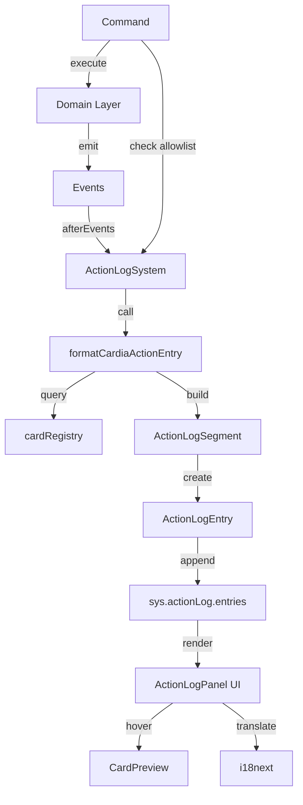
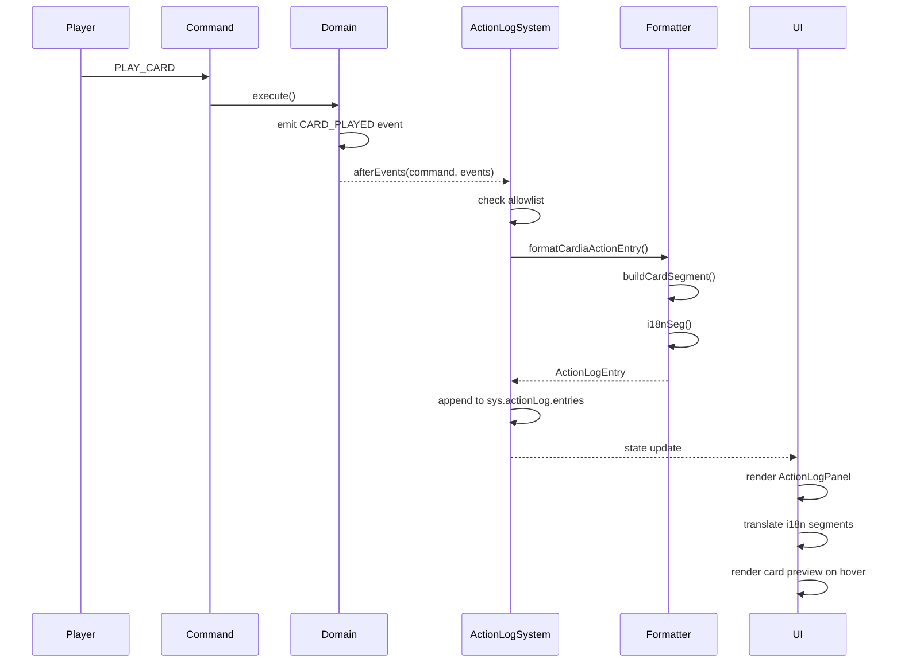

# Design Document: Cardia 行为日志系统

## Overview

本设计文档定义 Cardia 游戏行为日志系统（ActionLog）的技术实现方案。该系统将记录所有有意义的玩家操作和游戏事件，支持国际化，并与现有 UI 组件集成，为玩家提供完整的游戏历史回顾功能。

### 设计目标

1. **完整记录**：记录所有有意义的命令和事件（卡牌打出、能力激活、印戒授予等）
2. **国际化支持**：使用 i18n segment 延迟翻译，支持中英文
3. **卡牌预览**：支持悬停卡牌名称时显示卡牌预览
4. **可扩展性**：格式化函数易于扩展，支持未来新增事件类型
5. **性能优化**：使用白名单机制，只记录必要的命令和事件

### 参考实现

- **Dice Throne**: `src/games/dicethrone/game.ts` - ActionLogSystem 集成模式
- **Smash Up**: `src/games/smashup/actionLog.ts` - 格式化函数实现模式
- **引擎层**: `src/engine/primitives/actionLogHelpers.ts` - 通用辅助工具

## Architecture

### 系统架构图

```
┌─────────────────────────────────────────────────────────────┐
│                      Cardia Game Engine                      │
├─────────────────────────────────────────────────────────────┤
│                                                               │
│  ┌──────────────┐      ┌──────────────────────────────┐    │
│  │   Command    │─────▶│   ActionLogSystem            │    │
│  │   (Player)   │      │   - commandAllowlist         │    │
│  └──────────────┘      │   - formatEntry              │    │
│         │              └──────────────────────────────┘    │
│         ▼                           │                       │
│  ┌──────────────┐                   │                       │
│  │   Execute    │                   ▼                       │
│  │   (Domain)   │      ┌──────────────────────────────┐    │
│  └──────────────┘      │   formatCardiaActionEntry    │    │
│         │              │   - 命令格式化                │    │
│         ▼              │   - 事件格式化                │    │
│  ┌──────────────┐      │   - segment 构建              │    │
│  │   Events     │─────▶└──────────────────────────────┘    │
│  │   (Domain)   │                   │                       │
│  └──────────────┘                   ▼                       │
│                        ┌──────────────────────────────┐    │
│                        │   ActionLogEntry             │    │
│                        │   - id, timestamp            │    │
│                        │   - actorId, kind            │    │
│                        │   - segments[]               │    │
│                        └──────────────────────────────┘    │
│                                     │                       │
└─────────────────────────────────────┼───────────────────────┘
                                      │
                                      ▼
                        ┌──────────────────────────────┐
                        │   UI Layer (ActionLogPanel)  │
                        │   - 渲染日志条目              │
                        │   - 卡牌预览悬停              │
                        │   - i18n 翻译                 │
                        └──────────────────────────────┘
```

### 数据流图

```
┌─────────────┐
│   Command   │
│ (PLAY_CARD) │
└──────┬──────┘
       │
       ▼
┌─────────────────────────────────────────────────────┐
│  ActionLogSystem.afterEvents                        │
│  1. 检查命令是否在白名单                             │
│  2. 调用 formatCardiaActionEntry                    │
└──────┬──────────────────────────────────────────────┘
       │
       ▼
┌─────────────────────────────────────────────────────┐
│  formatCardiaActionEntry                            │
│  1. 根据命令类型分发到对应格式化函数                 │
│  2. 从事件列表中提取相关事件                         │
│  3. 构建 ActionLogSegment[]                         │
│  4. 返回 ActionLogEntry                             │
└──────┬──────────────────────────────────────────────┘
       │
       ▼
┌─────────────────────────────────────────────────────┐
│  buildCardSegment / i18nSeg                         │
│  1. 查询 cardRegistry 获取卡牌信息                   │
│  2. 构建 card segment (含 previewRef)               │
│  3. 构建 i18n segment (含 ns, key, params)          │
└──────┬──────────────────────────────────────────────┘
       │
       ▼
┌─────────────────────────────────────────────────────┐
│  ActionLogEntry                                     │
│  {                                                  │
│    id: "log-1234567890",                           │
│    timestamp: 1234567890,                          │
│    actorId: "0",                                   │
│    kind: "cardia:play_card",                       │
│    segments: [                                     │
│      { type: "i18n", ns: "game-cardia",           │
│        key: "actionLog.playCard" },               │
│      { type: "card", cardId: "deck_i_card_01",    │
│        previewText: "cards.deck_i_card_01.name",  │
│        previewTextNs: "game-cardia",              │
│        previewRef: {...} },                       │
│      { type: "i18n", ns: "game-cardia",           │
│        key: "actionLog.toSlot",                   │
│        params: { slot: 0 } }                      │
│    ]                                               │
│  }                                                 │
└──────┬──────────────────────────────────────────────┘
       │
       ▼
┌─────────────────────────────────────────────────────┐
│  sys.actionLog.entries[]                            │
│  (存储在游戏状态中)                                  │
└─────────────────────────────────────────────────────┘
```

## Components and Interfaces

### 核心组件

#### 1. ActionLogSystem (引擎层)

**位置**: `src/engine/systems/ActionLogSystem.ts`

**职责**:
- 在 `afterEvents` 钩子中拦截命令和事件
- 检查命令是否在白名单中
- 调用游戏层提供的 `formatEntry` 函数
- 将生成的日志条目追加到 `sys.actionLog.entries`

**配置接口**:
```typescript
interface ActionLogSystemConfig {
    maxEntries?: number;
    commandAllowlist?: CommandAllowlist;
    formatEntry?: (args: {
        command: Command;
        state: MatchState<unknown>;
        events: GameEvent[];
    }) => ActionLogEntry | ActionLogEntry[] | null;
}
```

#### 2. formatCardiaActionEntry (游戏层)

**位置**: `src/games/cardia/actionLog.ts`

**职责**:
- 根据命令类型分发到对应的格式化函数
- 从事件列表中提取相关事件
- 构建 ActionLogSegment 数组
- 返回 ActionLogEntry 或 ActionLogEntry[] 或 null

**函数签名**:
```typescript
export function formatCardiaActionEntry({
    command,
    state,
    events,
}: {
    command: Command;
    state: MatchState<unknown>;
    events: GameEvent[];
}): ActionLogEntry | ActionLogEntry[] | null
```

#### 3. cardPreviewHelper (游戏层)

**位置**: `src/games/cardia/ui/cardPreviewHelper.ts`

**职责**:
- 从 cardRegistry 查询卡牌定义
- 返回卡牌名称和预览引用
- 注册到全局 cardPreviewRegistry

**函数签名**:
```typescript
export function getCardiaCardPreviewMeta(cardId: string): CardPreviewMeta | null
export function getCardiaCardPreviewRef(cardId: string): CardPreviewRef | null
```

**接口定义**:
```typescript
interface CardPreviewMeta {
    name: string;
    previewRef: CardPreviewRef | null;
}
```

### 数据结构

#### ActionLogEntry

```typescript
interface ActionLogEntry {
    id: string;                    // 唯一 ID
    timestamp: number;             // 时间戳
    actorId: PlayerId;            // 执行者 ID
    kind: string;                 // 命令类型
    segments: ActionLogSegment[]; // 显示片段
}
```

#### ActionLogSegment

```typescript
type ActionLogSegment =
    | { type: 'text'; text: string }
    | {
          type: 'card';
          cardId: string;
          previewText?: string;
          previewTextNs?: string;
          previewRef?: CardPreviewRef;
      }
    | {
          type: 'i18n';
          ns: string;
          key: string;
          params?: Record<string, string | number>;
          paramI18nKeys?: string[];
      };
```

### 白名单配置

#### ACTION_ALLOWLIST (记录白名单)

记录所有有意义的玩家操作和交互解决后产生的事件。

```typescript
export const ACTION_ALLOWLIST = [
    CARDIA_COMMANDS.PLAY_CARD,
    CARDIA_COMMANDS.ACTIVATE_ABILITY,
    CARDIA_COMMANDS.SKIP_ABILITY,
    CARDIA_COMMANDS.END_TURN,
    CARDIA_COMMANDS.ADD_MODIFIER,
    CARDIA_COMMANDS.REMOVE_MODIFIER,
    INTERACTION_COMMANDS.RESPOND,  // 交互解决后产生的事件
] as const;
```

#### UNDO_ALLOWLIST (撤回白名单)

只包含玩家主动决策点命令，不包含系统命令和连锁命令。

```typescript
export const UNDO_ALLOWLIST = [
    CARDIA_COMMANDS.PLAY_CARD,
    CARDIA_COMMANDS.ACTIVATE_ABILITY,
    CARDIA_COMMANDS.ADD_MODIFIER,
    CARDIA_COMMANDS.REMOVE_MODIFIER,
] as const;
```

## Data Models

### 卡牌数据模型

```typescript
interface CardDef {
    id: CardId;
    influence: number;
    faction: FactionId;
    abilityIds: AbilityId[];
    difficulty: number;
    deckVariant: DeckVariantId;
    nameKey: string;           // i18n key
    descriptionKey: string;    // i18n key
    imagePath: string;         // 图片路径
}
```

### 命令数据模型

```typescript
// 打牌命令
interface PlayCardCommand extends Command<'cardia:play_card'> {
    payload: {
        cardUid: string;
        slotIndex: number;
    };
}

// 激活能力命令
interface ActivateAbilityCommand extends Command<'cardia:activate_ability'> {
    payload: {
        abilityId: string;
        sourceCardUid: string;
    };
}

// 跳过能力命令
interface SkipAbilityCommand extends Command<'cardia:skip_ability'> {
    payload: {
        playerId: PlayerId;
    };
}

// 回合结束命令
interface EndTurnCommand extends Command<'cardia:end_turn'> {
    payload: Record<string, never>;
}
```

### 事件数据模型

```typescript
// 卡牌打出事件
interface CardPlayedEvent extends GameEvent<'cardia:card_played'> {
    payload: {
        cardUid: string;
        playerId: PlayerId;
        slotIndex: number;
    };
}

// 能力激活事件
interface AbilityActivatedEvent extends GameEvent<'cardia:ability_activated'> {
    payload: {
        abilityId: string;
        cardId: string;
        playerId: PlayerId;
        isInstant: boolean;
        isOngoing: boolean;
    };
}

// 印戒授予事件
interface SignetGrantedEvent extends GameEvent<'cardia:signet_granted'> {
    payload: {
        playerId: PlayerId;
        cardUid: string;
        newTotal?: number;
    };
}

// 修正标记放置事件
interface ModifierTokenPlacedEvent extends GameEvent<'cardia:modifier_token_placed'> {
    payload: {
        cardId: string;
        value: number;
        source: string;
        timestamp: number;
    };
}

// 持续能力放置事件
interface OngoingAbilityPlacedEvent extends GameEvent<'cardia:ongoing_ability_placed'> {
    payload: {
        abilityId: string;
        cardId: string;
        playerId: PlayerId;
        effectType: string;
        timestamp: number;
        encounterIndex?: number;
        conditional?: boolean;
    };
}
```

## Correctness Properties

*A property is a characteristic or behavior that should hold true across all valid executions of a system-essentially, a formal statement about what the system should do. Properties serve as the bridge between human-readable specifications and machine-verifiable correctness guarantees.*

### Property 1: 命令记录完整性

*For any* 白名单中的命令（PLAY_CARD, ACTIVATE_ABILITY, SKIP_ABILITY, END_TURN, ADD_MODIFIER, REMOVE_MODIFIER, RESPOND），执行命令后，ActionLog 应包含对应的日志条目，且条目的 kind 字段应与命令类型一致。

**Validates: Requirements 2.1, 2.2, 2.3, 2.4, 2.5, 8.3, 8.4**

### Property 2: 事件记录完整性

*For any* 游戏事件（CARD_PLAYED, CARD_DRAWN, ENCOUNTER_RESOLVED, ABILITY_ACTIVATED, SIGNET_GRANTED, MODIFIER_TOKEN_PLACED, MODIFIER_TOKEN_REMOVED, ONGOING_ABILITY_PLACED, ONGOING_ABILITY_REMOVED, CARDS_DISCARDED, CARD_REPLACED, FACTION_SELECTED, SIGNET_MOVED, SIGNET_REMOVED, EXTRA_SIGNET_PLACED），当事件发生时，ActionLog 应包含对应的日志条目，且条目的 segments 应包含事件的关键信息（玩家、卡牌、数值、位置等）。

**Validates: Requirements 3.1, 3.2, 3.3, 3.4, 3.5, 3.6, 3.7, 3.8, 3.9, 3.10, 3.11, 3.12, 7.2, 7.3, 7.4, 9.3, 9.4**

### Property 3: i18n Segment 正确性

*For any* 日志条目，所有文本片段应使用 i18n segment（type: 'i18n'），且 ns 字段应为 'game-cardia'，key 字段应为有效的 i18n key。

**Validates: Requirements 4.1, 4.2**

### Property 4: 卡牌 Segment 正确性

*For any* 包含卡牌信息的日志条目，卡牌片段应使用 card segment（type: 'card'），且应包含 cardId、previewText、previewRef 字段。当卡牌名称为 i18n key（包含 '.'）时，应设置 previewTextNs 为 'game-cardia'。

**Validates: Requirements 4.4, 5.1, 5.2, 5.3**

### Property 5: i18n 参数标记正确性

*For any* i18n segment，当参数值为 i18n key 时，应在 paramI18nKeys 数组中标记该参数名。

**Validates: Requirements 4.5**

### Property 6: 卡牌预览函数正确性

*For any* 有效的卡牌 ID，getCardiaCardPreviewMeta 函数应从 cardRegistry 查找卡牌定义，并返回包含 name 和 previewRef 的对象。当卡牌不存在时，应返回 null。

**Validates: Requirements 12.2, 12.3**

### Property 7: 遭遇位置显示正确性

*For any* 包含遭遇位置的日志条目（卡牌打出、遭遇结算等），应使用 i18n segment 显示遭遇位置（slot 0、slot 1、slot 2），且 i18n key 应包含遭遇位置参数。

**Validates: Requirements 6.1, 6.2**

### Property 8: 时间戳单调性

*For any* 日志条目，条目的 timestamp 应大于或等于命令的 timestamp。当多个事件在同一命令中产生时，事件的 timestamp 应递增（使用偏移量）。

**Validates: Requirements 11.1, 11.2, 11.4**

### Property 9: 条目 ID 唯一性

*For any* 两个不同的日志条目，它们的 id 字段应不同。

**Validates: Requirements 13.6**

### Property 10: Segment 类型正确性

*For any* 日志条目，segments 数组中的每个元素应为有效的 ActionLogSegment 类型（text, card, i18n），且应使用对应的工厂函数（i18nSeg, buildCardSegment）创建。

**Validates: Requirements 13.4, 13.5**

### Property 11: 格式化函数返回类型正确性

*For any* 命令和事件组合，formatCardiaActionEntry 函数应返回 ActionLogEntry、ActionLogEntry[] 或 null。当命令不在白名单中时，应返回 null。

**Validates: Requirements 13.3**

## Error Handling

### 错误场景

1. **卡牌不存在**
   - 场景：格式化日志时引用的卡牌 ID 在 cardRegistry 中不存在
   - 处理：getCardiaCardPreviewMeta 返回 null，buildCardSegment fallback 到纯文本显示
   - 影响：日志条目仍然生成，但卡牌名称显示为 cardId，无预览功能

2. **事件缺失关键字段**
   - 场景：事件 payload 缺少必需的字段（如 cardUid, playerId）
   - 处理：格式化函数跳过该事件，返回 null
   - 影响：该事件不会生成日志条目，但不影响其他事件

3. **命令不在白名单**
   - 场景：执行的命令不在 ACTION_ALLOWLIST 中
   - 处理：ActionLogSystem 不调用 formatEntry，不生成日志条目
   - 影响：该命令不会被记录，符合预期行为

4. **i18n key 不存在**
   - 场景：生成的 i18n segment 引用的 key 在 locale 文件中不存在
   - 处理：UI 层渲染时显示 raw key（如 "actionLog.playCard"）
   - 影响：日志条目显示不友好，但不影响功能

### 错误恢复策略

1. **Graceful Degradation**
   - 卡牌预览失败时 fallback 到纯文本
   - 事件格式化失败时跳过该事件，继续处理其他事件
   - 单个日志条目生成失败不影响整体系统

2. **日志记录**
   - 格式化函数内部不抛出异常，使用 console.warn 记录警告
   - 关键错误（如 cardRegistry 未初始化）在开发环境抛出异常

3. **类型安全**
   - 使用 TypeScript 类型守卫确保事件 payload 结构正确
   - 使用可选链操作符（?.）安全访问嵌套字段

## Testing Strategy

### 测试方法

本系统采用**双重测试策略**：单元测试验证具体场景和边界条件，属性测试验证通用规则在所有输入下的正确性。

#### 单元测试（Vitest）

**测试文件**: `src/games/cardia/__tests__/actionLog.test.ts`

**测试范围**:
1. **系统集成测试**（验证配置和导出）
   - 验证 ACTION_ALLOWLIST 包含所有必需的命令类型
   - 验证 UNDO_ALLOWLIST 包含正确的命令类型
   - 验证 formatCardiaActionEntry 函数导出
   - 验证 getCardiaCardPreviewRef 函数导出

2. **边界条件测试**
   - 卡牌不存在时 getCardiaCardPreviewMeta 返回 null
   - 命令不在白名单时 formatCardiaActionEntry 返回 null
   - 事件缺失关键字段时格式化函数返回 null

3. **具体场景测试**（每种命令/事件类型 1-2 个代表性用例）
   - PLAY_CARD 命令生成正确的日志条目
   - CARD_PLAYED 事件包含卡牌名称和遭遇位置
   - SIGNET_GRANTED 事件包含玩家、卡牌和印戒总数
   - i18n segment 包含正确的 ns 和 key
   - card segment 包含正确的 previewRef

#### 属性测试（fast-check）

**测试文件**: `src/games/cardia/__tests__/actionLog.property.test.ts`

**测试配置**:
- 每个属性测试运行 100 次迭代
- 使用 fast-check 生成随机输入
- 每个测试用例标注对应的设计属性

**测试范围**:
1. **Property 1: 命令记录完整性**
   - 生成随机命令（白名单中的类型）
   - 验证生成的日志条目 kind 与命令类型一致
   - 标签: `Feature: cardia-action-log, Property 1: 命令记录完整性`

2. **Property 2: 事件记录完整性**
   - 生成随机事件（所有支持的事件类型）
   - 验证生成的日志条目包含事件关键信息
   - 标签: `Feature: cardia-action-log, Property 2: 事件记录完整性`

3. **Property 3: i18n Segment 正确性**
   - 生成随机命令和事件
   - 验证所有文本片段使用 i18n segment
   - 验证 ns 字段为 'game-cardia'
   - 标签: `Feature: cardia-action-log, Property 3: i18n Segment 正确性`

4. **Property 4: 卡牌 Segment 正确性**
   - 生成随机卡牌相关事件
   - 验证卡牌片段使用 card segment
   - 验证包含 cardId、previewText、previewRef
   - 验证 i18n key 时设置 previewTextNs
   - 标签: `Feature: cardia-action-log, Property 4: 卡牌 Segment 正确性`

5. **Property 6: 卡牌预览函数正确性**
   - 生成随机卡牌 ID（包括有效和无效）
   - 验证函数返回值结构正确
   - 验证不存在的卡牌返回 null
   - 标签: `Feature: cardia-action-log, Property 6: 卡牌预览函数正确性`

6. **Property 8: 时间戳单调性**
   - 生成随机命令和多个事件
   - 验证事件时间戳 >= 命令时间戳
   - 验证多个事件时间戳递增
   - 标签: `Feature: cardia-action-log, Property 8: 时间戳单调性`

7. **Property 9: 条目 ID 唯一性**
   - 生成多个随机命令
   - 验证所有生成的日志条目 ID 不重复
   - 标签: `Feature: cardia-action-log, Property 9: 条目 ID 唯一性`

#### E2E 测试（Playwright）

**测试文件**: `e2e/cardia-action-log.e2e.ts`

**测试范围**:
1. **日志面板显示**
   - 验证 ActionLogPanel 组件正确渲染
   - 验证日志条目按时间倒序显示

2. **卡牌预览交互**
   - 悬停卡牌名称时显示预览
   - 预览内容包含卡牌图片和描述

3. **国际化切换**
   - 切换语言后日志文本正确翻译
   - 卡牌名称正确翻译

### 测试工具

- **Vitest**: 单元测试和属性测试
- **fast-check**: 属性测试的随机输入生成
- **Playwright**: E2E 测试
- **@testing-library/react**: React 组件测试（如需测试 UI 组件）

### 测试覆盖目标

- **单元测试**: 覆盖所有命令和事件类型的格式化逻辑
- **属性测试**: 覆盖所有通用规则（11 个属性）
- **E2E 测试**: 覆盖关键用户交互流程（日志显示、卡牌预览、国际化）

### 测试执行

```bash
# 运行单元测试
npm run test -- actionLog

# 运行属性测试
npm run test -- actionLog.property

# 运行 E2E 测试
npm run test:e2e:ci -- cardia-action-log.e2e.ts
```

## Implementation Details

### 文件结构

```
src/games/cardia/
├── actionLog.ts                    # 主文件：白名单 + 格式化函数
├── ui/
│   └── cardPreviewHelper.ts        # 卡牌预览辅助函数
├── game.ts                         # 游戏引擎集成（修改）
└── __tests__/
    ├── actionLog.test.ts           # 单元测试
    └── actionLog.property.test.ts  # 属性测试

e2e/
└── cardia-action-log.e2e.ts        # E2E 测试

public/locales/
├── zh-CN/
│   └── game-cardia.json            # 中文文案（新增 actionLog 部分）
└── en/
    └── game-cardia.json            # 英文文案（新增 actionLog 部分）
```

### 核心实现

#### 1. actionLog.ts

```typescript
/**
 * Cardia - ActionLog 格式化
 * 
 * 使用 i18n segment 延迟翻译，避免服务端无 i18n 环境导致显示 raw key。
 */

import type {
    ActionLogEntry,
    ActionLogSegment,
    Command,
    GameEvent,
    MatchState,
    PlayerId,
} from '../../engine/types';
import { INTERACTION_COMMANDS } from '../../engine/systems/InteractionSystem';
import { CARDIA_COMMANDS, CARDIA_EVENTS } from './domain';
import type { CardiaCore } from './domain/types';
import { getCardiaCardPreviewMeta } from './ui/cardPreviewHelper';

// ============================================================================
// 白名单定义
// ============================================================================

/**
 * 操作日志白名单：记录所有有意义的玩家操作。
 */
export const ACTION_ALLOWLIST = [
    CARDIA_COMMANDS.PLAY_CARD,
    CARDIA_COMMANDS.ACTIVATE_ABILITY,
    CARDIA_COMMANDS.SKIP_ABILITY,
    CARDIA_COMMANDS.END_TURN,
    CARDIA_COMMANDS.ADD_MODIFIER,
    CARDIA_COMMANDS.REMOVE_MODIFIER,
    INTERACTION_COMMANDS.RESPOND,  // 交互解决后产生的事件
] as const;

/**
 * 撤回快照白名单：只包含"玩家主动决策点"命令。
 */
export const UNDO_ALLOWLIST = [
    CARDIA_COMMANDS.PLAY_CARD,
    CARDIA_COMMANDS.ACTIVATE_ABILITY,
    CARDIA_COMMANDS.ADD_MODIFIER,
    CARDIA_COMMANDS.REMOVE_MODIFIER,
] as const;

const CARDIA_NS = 'game-cardia';

/** i18n segment 工厂 */
const i18nSeg = (
    key: string,
    params?: Record<string, string | number>,
    paramI18nKeys?: string[],
): ActionLogSegment => ({
    type: 'i18n' as const,
    ns: CARDIA_NS,
    key,
    ...(params ? { params } : {}),
    ...(paramI18nKeys ? { paramI18nKeys } : {}),
});

const textSegment = (text: string): ActionLogSegment => ({ type: 'text', text });

/** 构建卡牌 segment */
const buildCardSegment = (cardId?: string): ActionLogSegment | null => {
    if (!cardId) return null;
    const meta = getCardiaCardPreviewMeta(cardId);
    if (!meta) return textSegment(cardId);
    
    const isI18nKey = meta.name.includes('.');
    if (meta.previewRef) {
        return {
            type: 'card',
            cardId,
            previewText: meta.name,
            previewRef: meta.previewRef,
            ...(isI18nKey ? { previewTextNs: CARDIA_NS } : {}),
        };
    }
    if (isI18nKey) {
        return i18nSeg(meta.name);
    }
    return textSegment(meta.name);
};

// ============================================================================
// ActionLog 格式化
// ============================================================================

export function formatCardiaActionEntry({
    command,
    state: _state,
    events,
}: {
    command: Command;
    state: MatchState<unknown>;
    events: GameEvent[];
}): ActionLogEntry | ActionLogEntry[] | null {
    const state = _state as MatchState<CardiaCore>;
    const timestamp = typeof command.timestamp === 'number' ? command.timestamp : 0;
    const actorId = command.playerId;

    // 命令格式化
    switch (command.type) {
        case CARDIA_COMMANDS.PLAY_CARD: {
            const cardPlayedEvent = events.find(e => e.type === CARDIA_EVENTS.CARD_PLAYED);
            if (!cardPlayedEvent) return null;
            
            const { cardUid, slotIndex } = cardPlayedEvent.payload;
            const cardSeg = buildCardSegment(cardUid);
            if (!cardSeg) return null;

            return {
                id: `log-${timestamp}`,
                timestamp,
                actorId,
                kind: command.type,
                segments: [
                    i18nSeg('actionLog.playCard'),
                    cardSeg,
                    i18nSeg('actionLog.toSlot', { slot: slotIndex }),
                ],
            };
        }

        case CARDIA_COMMANDS.ACTIVATE_ABILITY: {
            const abilityEvent = events.find(e => e.type === CARDIA_EVENTS.ABILITY_ACTIVATED);
            if (!abilityEvent) return null;
            
            const { abilityId, cardId } = abilityEvent.payload;
            const cardSeg = buildCardSegment(cardId);
            if (!cardSeg) return null;

            return {
                id: `log-${timestamp}`,
                timestamp,
                actorId,
                kind: command.type,
                segments: [
                    i18nSeg('actionLog.activateAbility'),
                    cardSeg,
                    i18nSeg('actionLog.ability', { abilityId }),
                ],
            };
        }

        case CARDIA_COMMANDS.SKIP_ABILITY: {
            return {
                id: `log-${timestamp}`,
                timestamp,
                actorId,
                kind: command.type,
                segments: [i18nSeg('actionLog.skipAbility')],
            };
        }

        case CARDIA_COMMANDS.END_TURN: {
            return {
                id: `log-${timestamp}`,
                timestamp,
                actorId,
                kind: command.type,
                segments: [i18nSeg('actionLog.endTurn')],
            };
        }

        case CARDIA_COMMANDS.ADD_MODIFIER: {
            const { cardUid, modifierValue } = command.payload;
            const cardSeg = buildCardSegment(cardUid);
            if (!cardSeg) return null;

            return {
                id: `log-${timestamp}`,
                timestamp,
                actorId,
                kind: command.type,
                segments: [
                    i18nSeg('actionLog.addModifier'),
                    cardSeg,
                    i18nSeg('actionLog.modifierValue', { value: modifierValue }),
                ],
            };
        }

        case CARDIA_COMMANDS.REMOVE_MODIFIER: {
            const { cardUid } = command.payload;
            const cardSeg = buildCardSegment(cardUid);
            if (!cardSeg) return null;

            return {
                id: `log-${timestamp}`,
                timestamp,
                actorId,
                kind: command.type,
                segments: [
                    i18nSeg('actionLog.removeModifier'),
                    cardSeg,
                ],
            };
        }

        case INTERACTION_COMMANDS.RESPOND: {
            // 交互解决后产生的事件（如选择卡牌、选择派系等）
            // 根据事件类型生成对应的日志条目
            const entries: ActionLogEntry[] = [];
            
            events.forEach((event, index) => {
                const eventTimestamp = timestamp + index + 1;
                let entry: ActionLogEntry | null = null;

                switch (event.type) {
                    case CARDIA_EVENTS.CARD_REPLACED: {
                        const { slotIndex, oldCardId, newCardId } = event.payload;
                        const oldCardSeg = buildCardSegment(oldCardId);
                        const newCardSeg = buildCardSegment(newCardId);
                        if (!oldCardSeg || !newCardSeg) break;

                        entry = {
                            id: `log-${eventTimestamp}`,
                            timestamp: eventTimestamp,
                            actorId,
                            kind: event.type,
                            segments: [
                                i18nSeg('actionLog.cardReplaced'),
                                oldCardSeg,
                                i18nSeg('actionLog.with'),
                                newCardSeg,
                                i18nSeg('actionLog.atSlot', { slot: slotIndex }),
                            ],
                        };
                        break;
                    }

                    case CARDIA_EVENTS.FACTION_SELECTED: {
                        const { faction } = event.payload;
                        entry = {
                            id: `log-${eventTimestamp}`,
                            timestamp: eventTimestamp,
                            actorId,
                            kind: event.type,
                            segments: [
                                i18nSeg('actionLog.factionSelected'),
                                i18nSeg(`factions.${faction}.name`),
                            ],
                        };
                        break;
                    }
                }

                if (entry) entries.push(entry);
            });

            return entries.length > 0 ? entries : null;
        }

        default:
            return null;
    }
}
```

#### 2. cardPreviewHelper.ts

```typescript
/**
 * Cardia - 卡牌预览映射
 *
 * 用于 ActionLog 的卡牌预览获取（基于卡牌定义的 previewRef）。
 */

import type { CardPreviewRef } from '../../../core';
import cardRegistry from '../domain/cardRegistry';

interface CardPreviewMeta {
    name: string;
    previewRef: CardPreviewRef | null;
}

/**
 * 获取 Cardia 卡牌预览元数据
 */
export const getCardiaCardPreviewMeta = (cardId: string): CardPreviewMeta | null => {
    const cardDef = cardRegistry.get(cardId);
    if (!cardDef) return null;

    return {
        name: cardDef.nameKey,
        previewRef: {
            type: 'renderer',
            rendererId: 'cardia-card-renderer',
            payload: { cardId },
        },
    };
};

/**
 * 获取 Cardia 卡牌预览引用（供 cardPreviewRegistry 注册）
 */
export const getCardiaCardPreviewRef = (cardId: string): CardPreviewRef | null => {
    return getCardiaCardPreviewMeta(cardId)?.previewRef ?? null;
};
```

#### 3. game.ts 修改

```typescript
// 在 game.ts 中添加 ActionLogSystem

import { createActionLogSystem } from '../../engine';
import { ACTION_ALLOWLIST, UNDO_ALLOWLIST, formatCardiaActionEntry } from './actionLog';

// 注册卡牌预览函数
import { registerCardPreviewGetter } from '../../core';
import { getCardiaCardPreviewRef } from './ui/cardPreviewHelper';
registerCardPreviewGetter('cardia', getCardiaCardPreviewRef);

/**
 * 系统组装
 */
export const systems = [
    createFlowSystem<CardiaCore>({ hooks: cardiaFlowHooks }),
    ...createBaseSystems<CardiaCore>(),
    createCardiaEventSystem(),
    createCheatSystem<CardiaCore>(cardiaCheatModifier),
    createActionLogSystem<CardiaCore>({
        commandAllowlist: ACTION_ALLOWLIST,
        formatEntry: formatCardiaActionEntry,
    }),
    createUndoSystem<CardiaCore>({
        commandAllowlist: UNDO_ALLOWLIST,
    }),
];
```

### 国际化文案

#### zh-CN/game-cardia.json

```json
{
  "actionLog": {
    "playCard": "打出",
    "toSlot": "到遭遇 {{slot}}",
    "atSlot": "在遭遇 {{slot}}",
    "activateAbility": "激活能力",
    "ability": "（{{abilityId}}）",
    "skipAbility": "跳过能力",
    "endTurn": "回合结束",
    "addModifier": "添加修正标记到",
    "removeModifier": "移除修正标记从",
    "modifierValue": "（{{value}}）",
    "cardReplaced": "替换",
    "with": "为",
    "factionSelected": "选择派系",
    "cardDrawn": "抽取 {{count}} 张卡牌",
    "encounterResolved": "遭遇 {{slot}} 结算，获胜方：{{winner}}",
    "signetGranted": "获得印戒（总数：{{total}}）",
    "modifierTokenPlaced": "放置修正标记 {{value}} 到",
    "modifierTokenRemoved": "移除修正标记从",
    "ongoingAbilityPlaced": "放置持续能力",
    "ongoingAbilityRemoved": "移除持续能力",
    "cardsDiscarded": "弃掉 {{count}} 张卡牌（来源：{{from}}）",
    "signetMoved": "印戒从",
    "to": "移动到",
    "signetRemoved": "移除印戒从",
    "extraSignetPlaced": "放置额外印戒到"
  }
}
```

#### en/game-cardia.json

```json
{
  "actionLog": {
    "playCard": "Played",
    "toSlot": "to Encounter {{slot}}",
    "atSlot": "at Encounter {{slot}}",
    "activateAbility": "Activated ability",
    "ability": "({{abilityId}})",
    "skipAbility": "Skipped ability",
    "endTurn": "End turn",
    "addModifier": "Added modifier token to",
    "removeModifier": "Removed modifier token from",
    "modifierValue": "({{value}})",
    "cardReplaced": "Replaced",
    "with": "with",
    "factionSelected": "Selected faction",
    "cardDrawn": "Drew {{count}} card(s)",
    "encounterResolved": "Encounter {{slot}} resolved, winner: {{winner}}",
    "signetGranted": "Gained signet (total: {{total}})",
    "modifierTokenPlaced": "Placed modifier token {{value}} on",
    "modifierTokenRemoved": "Removed modifier token from",
    "ongoingAbilityPlaced": "Placed ongoing ability",
    "ongoingAbilityRemoved": "Removed ongoing ability",
    "cardsDiscarded": "Discarded {{count}} card(s) (from: {{from}})",
    "signetMoved": "Signet moved from",
    "to": "to",
    "signetRemoved": "Removed signet from",
    "extraSignetPlaced": "Placed extra signet on"
  }
}
```

### 关键设计决策

#### 1. 使用 i18n segment 延迟翻译

**原因**:
- 服务端无 i18n 环境，直接翻译会显示 raw key
- 延迟翻译由客户端在渲染时完成，支持动态语言切换
- 符合 Smash Up 和 Dice Throne 的实现模式

**实现**:
```typescript
// ❌ 错误：服务端直接翻译
segments: [{ type: 'text', text: t('actionLog.playCard') }]

// ✅ 正确：延迟翻译
segments: [{ type: 'i18n', ns: 'game-cardia', key: 'actionLog.playCard' }]
```

#### 2. 使用 card segment 支持卡牌预览

**原因**:
- 用户悬停卡牌名称时可以看到卡牌预览
- 提升用户体验，快速查看卡牌信息
- 复用现有的 CardPreview 组件

**实现**:
```typescript
{
    type: 'card',
    cardId: 'deck_i_card_01',
    previewText: 'cards.deck_i_card_01.name',
    previewTextNs: 'game-cardia',
    previewRef: {
        type: 'renderer',
        rendererId: 'cardia-card-renderer',
        payload: { cardId: 'deck_i_card_01' }
    }
}
```

#### 3. 白名单机制控制记录范围

**原因**:
- 避免记录过多无意义的命令（如系统内部命令）
- 提升性能，减少日志条目数量
- 明确区分"记录白名单"和"撤回白名单"

**实现**:
- `ACTION_ALLOWLIST`: 记录所有有意义的玩家操作和交互解决后产生的事件
- `UNDO_ALLOWLIST`: 只包含玩家主动决策点命令，不包含系统命令和连锁命令

#### 4. 时间戳管理确保正确排序

**原因**:
- 日志条目需要按时间顺序显示
- 多个事件在同一命令中产生时需要区分顺序
- 支持 newest-first 排序

**实现**:
```typescript
// 命令时间戳
const timestamp = command.timestamp;

// 事件时间戳（递增偏移）
events.forEach((event, index) => {
    const eventTimestamp = timestamp + index + 1;
    // ...
});
```

### 扩展性考虑

#### 1. 新增命令类型

只需在 `formatCardiaActionEntry` 的 switch 语句中添加新的 case：

```typescript
case CARDIA_COMMANDS.NEW_COMMAND: {
    // 格式化逻辑
    return {
        id: `log-${timestamp}`,
        timestamp,
        actorId,
        kind: command.type,
        segments: [/* ... */],
    };
}
```

#### 2. 新增事件类型

在 `INTERACTION_COMMANDS.RESPOND` 的事件处理中添加新的 case：

```typescript
case CARDIA_EVENTS.NEW_EVENT: {
    // 格式化逻辑
    entry = {
        id: `log-${eventTimestamp}`,
        timestamp: eventTimestamp,
        actorId,
        kind: event.type,
        segments: [/* ... */],
    };
    break;
}
```

#### 3. 新增 segment 类型

如果需要新的 segment 类型（如 breakdown），可以参考引擎层的 `ActionLogSegment` 类型定义，并在格式化函数中使用。

### 性能优化

1. **白名单过滤**: 只记录白名单中的命令，避免不必要的格式化开销
2. **延迟翻译**: i18n segment 在渲染时才翻译，避免服务端翻译开销
3. **最大条目数**: ActionLogSystem 配置 `maxEntries: 50`，自动清理旧条目
4. **卡牌预览缓存**: cardRegistry 使用 Map 结构，O(1) 查询复杂度

## Appendix

### 参考资料

1. **引擎层文档**
   - `src/engine/systems/ActionLogSystem.ts` - ActionLogSystem 实现
   - `src/engine/primitives/actionLogHelpers.ts` - 通用辅助工具
   - `src/engine/types.ts` - ActionLogEntry 和 ActionLogSegment 类型定义

2. **参考实现**
   - `src/games/dicethrone/game.ts` - ActionLogSystem 集成模式
   - `src/games/smashup/actionLog.ts` - 格式化函数实现模式
   - `src/games/smashup/ui/cardPreviewHelper.ts` - 卡牌预览辅助函数模式

3. **领域层文档**
   - `src/games/cardia/domain/commands.ts` - 命令类型定义
   - `src/games/cardia/domain/events.ts` - 事件类型定义
   - `src/games/cardia/domain/cardRegistry.ts` - 卡牌注册表

### 术语表

- **ActionLog**: 行为日志系统，记录游戏中所有有意义的操作和事件
- **ActionLogEntry**: 单条日志条目，包含时间戳、执行者、操作类型和显示内容
- **ActionLogSegment**: 日志条目的显示片段，支持文本、i18n、卡牌预览等类型
- **Command**: 命令，玩家主动发起的操作（如打牌、激活能力）
- **Event**: 事件，游戏状态变化产生的通知（如卡牌打出、印戒授予）
- **Allowlist**: 白名单，定义哪些命令/事件需要记录到日志
- **i18n Segment**: 国际化片段，延迟翻译的文本片段，渲染时由客户端翻译
- **Card Preview Segment**: 卡牌预览片段，显示卡牌名称并支持悬停预览
- **Formatter**: 格式化函数，将命令和事件转换为日志条目
- **Undo Allowlist**: 撤回白名单，定义哪些命令可以创建撤回快照

### 架构图（Mermaid）



### 数据流图（Mermaid）



