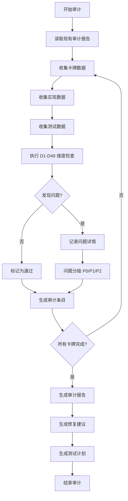

# Design Document: Cardia Deck I 全面审计系统

## Overview

本设计文档定义 Cardia 游戏 Deck I (card01-card16) 全面审计系统的架构、数据模型和实施方案。审计系统基于 `.spec/knowledge/standards/testing-audit.md` 的 D1-D49 维度框架，系统性地审查所有卡牌效果实现和 E2E 测试覆盖。

### 设计目标

1. **自动化检查**：自动化检查每张卡牌的实现完整性
2. **测试覆盖评估**：评估 E2E 测试覆盖质量
3. **结构化报告**：生成结构化的审计报告
4. **可执行建议**：提供可执行的修复建议

### 核心原则

- **数据驱动**：审计规则和检查项通过配置驱动，易于扩展
- **增量审计**：支持基于现有 AUDIT-REPORT.md 的增量审计
- **优先级分级**：问题按 P0/P1/P2 分级，便于修复排序
- **可追溯性**：每个问题都关联到具体的审计维度和卡牌

## Architecture

### 系统架构

```
┌─────────────────────────────────────────────────────────────┐
│                    审计系统架构                              │
├─────────────────────────────────────────────────────────────┤
│                                                              │
│  ┌──────────────┐    ┌──────────────┐    ┌──────────────┐ │
│  │  数据收集层   │───▶│  审计引擎层   │───▶│  报告生成层   │ │
│  └──────────────┘    └──────────────┘    └──────────────┘ │
│         │                    │                    │         │
│         ▼                    ▼                    ▼         │
│  ┌──────────────┐    ┌──────────────┐    ┌──────────────┐ │
│  │ 规则文档      │    │ D1-D49 维度  │    │ Markdown     │ │
│  │ cardRegistry │    │ 检查器集合    │    │ 报告         │ │
│  │ abilityReg   │    │ 问题分类器    │    │ 修复建议     │ │
│  │ E2E 测试     │    │ 优先级判定    │    │ 测试计划     │ │
│  └──────────────┘    └──────────────┘    └──────────────┘ │
│                                                              │
└─────────────────────────────────────────────────────────────┘
```

### 审计流程



### 分阶段执行

审计系统分为三个主要阶段：

1. **实现审计阶段**
   - 检查 abilityRegistry 定义
   - 检查 group*.ts 执行器
   - 验证定义→注册→执行链路
   - 应用 D1（语义保真）、D2（边界完整）、D3（数据流闭环）

2. **测试审计阶段**
   - 列出所有 E2E 测试文件
   - 评估测试覆盖状态
   - 检查测试质量（断言、模式、状态验证）
   - 应用 D47（E2E 测试覆盖完整性）

3. **报告生成阶段**
   - 汇总所有审计结果
   - 按优先级分类问题
   - 生成修复建议
   - 生成测试补充计划

## Components and Interfaces

### 核心组件

#### 1. 数据收集器 (DataCollector)

负责收集审计所需的所有数据源。

```typescript
interface DataCollector {
  // 收集卡牌定义
  collectCardDefinitions(): CardDefinition[];
  
  // 收集能力定义
  collectAbilityDefinitions(): AbilityDefinition[];
  
  // 收集能力执行器
  collectAbilityExecutors(): AbilityExecutor[];
  
  // 收集 E2E 测试文件
  collectE2ETests(): E2ETestFile[];
  
  // 读取规则文档
  readRuleDocument(): RuleDocument;
  
  // 读取现有审计报告
  readExistingAuditReport(): AuditReport | null;
}
```

#### 2. 审计引擎 (AuditEngine)

执行 D1-D49 维度检查的核心引擎。

```typescript
interface AuditEngine {
  // 执行单张卡牌的审计
  auditCard(card: CardDefinition, context: AuditContext): CardAuditResult;
  
  // 应用特定维度的检查
  applyDimension(dimension: AuditDimension, target: AuditTarget): DimensionResult;
  
  // 问题分级
  classifyIssue(issue: AuditIssue): IssuePriority;
  
  // 生成修复建议
  generateFixSuggestion(issue: AuditIssue): FixSuggestion;
}
```

#### 3. 维度检查器 (DimensionChecker)

实现具体的 D1-D49 维度检查逻辑。

```typescript
interface DimensionChecker {
  // 维度 ID
  dimensionId: string;
  
  // 维度名称
  dimensionName: string;
  
  // 执行检查
  check(target: AuditTarget, context: AuditContext): CheckResult;
  
  // 生成问题描述
  describeIssue(result: CheckResult): string;
}

// 关键维度检查器
interface D1SemanticFidelityChecker extends DimensionChecker {
  // 检查描述与实现一致性
  checkDescriptionMatch(ability: AbilityDefinition, executor: AbilityExecutor): boolean;
  
  // 检查触发时机一致性
  checkTriggerMatch(ability: AbilityDefinition, executor: AbilityExecutor): boolean;
  
  // 检查目标选择一致性
  checkTargetMatch(ability: AbilityDefinition, executor: AbilityExecutor): boolean;
}

interface D47E2ECoverageChecker extends DimensionChecker {
  // 检查测试覆盖状态
  checkCoverageStatus(card: CardDefinition, tests: E2ETestFile[]): CoverageStatus;
  
  // 检查测试质量
  checkTestQuality(test: E2ETestFile): TestQuality;
  
  // 识别测试缺口
  identifyGaps(card: CardDefinition, tests: E2ETestFile[]): TestGap[];
}
```

#### 4. 报告生成器 (ReportGenerator)

生成结构化的审计报告。

```typescript
interface ReportGenerator {
  // 生成完整审计报告
  generateReport(results: CardAuditResult[]): AuditReport;
  
  // 生成卡牌审计条目
  generateCardEntry(result: CardAuditResult): string;
  
  // 生成问题汇总
  generateIssueSummary(results: CardAuditResult[]): string;
  
  // 生成修复建议
  generateFixSuggestions(results: CardAuditResult[]): string;
  
  // 生成测试计划
  generateTestPlan(results: CardAuditResult[]): string;
}
```

## Data Models

### 卡牌审计条目 (CardAuditEntry)

```typescript
interface CardAuditEntry {
  // 卡牌基本信息
  cardId: string;              // 如 "MERCENARY_SWORDSMAN"
  cardNumber: number;          // 1-16
  cardName: string;            // 如 "雇佣剑士"
  influence: number;           // 影响力值
  
  // 能力信息
  abilityId: string;           // 能力 ID
  abilityType: 'onLose' | 'ongoing';
  abilityDescription: string;  // 权威描述
  
  // 审计结果
  implementationStatus: 'pass' | 'fail' | 'warning';
  testCoverageStatus: 'full' | 'partial' | 'none';
  
  // 发现的问题
  issues: AuditIssue[];
  
  // 应用的维度
  dimensionsApplied: string[]; // 如 ['D1', 'D2', 'D3', 'D47']
}
```

### 审计问题 (AuditIssue)

```typescript
interface AuditIssue {
  // 问题 ID
  issueId: string;
  
  // 问题类型
  type: 'implementation' | 'test-coverage' | 'test-quality' | 'boundary';
  
  // 优先级
  priority: 'P0' | 'P1' | 'P2';
  
  // 问题描述
  description: string;
  
  // 相关维度
  dimension: string;           // 如 'D1'
  
  // 证据
  evidence: {
    expected: string;          // 期望行为
    actual: string;            // 实际行为
    location: string;          // 代码位置
  };
  
  // 修复建议
  fixSuggestion: FixSuggestion;
}
```

### 修复建议 (FixSuggestion)

```typescript
interface FixSuggestion {
  // 建议类型
  type: 'code-fix' | 'test-add' | 'test-improve' | 'rename';
  
  // 建议描述
  description: string;
  
  // 具体步骤
  steps: string[];
  
  // 影响范围
  impact: 'low' | 'medium' | 'high';
  
  // 预估工作量
  effort: 'small' | 'medium' | 'large';
}
```

### 测试覆盖状态 (TestCoverageStatus)

```typescript
interface TestCoverageStatus {
  // 卡牌 ID
  cardId: string;
  
  // 是否有 E2E 测试
  hasE2ETest: boolean;
  
  // 测试文件路径
  testFilePath?: string;
  
  // 覆盖的场景
  coveredScenarios: TestScenario[];
  
  // 缺失的场景
  missingScenarios: TestScenario[];
  
  // 测试质量评分
  qualityScore: number;        // 0-100
  
  // 质量问题
  qualityIssues: TestQualityIssue[];
}

interface TestScenario {
  type: 'core' | 'boundary' | 'interaction';
  description: string;
  covered: boolean;
}

interface TestQualityIssue {
  type: 'no-assertion' | 'wrong-mode' | 'no-final-state' | 'fake-pass';
  description: string;
  location: string;
}
```

### 审计上下文 (AuditContext)

```typescript
interface AuditContext {
  // 规则文档
  ruleDocument: RuleDocument;
  
  // 所有卡牌定义
  allCards: CardDefinition[];
  
  // 所有能力定义
  allAbilities: Map<string, AbilityDefinition>;
  
  // 所有能力执行器
  allExecutors: Map<string, AbilityExecutor>;
  
  // 所有 E2E 测试
  allTests: E2ETestFile[];
  
  // 现有审计报告
  existingReport?: AuditReport;
}
```

### 问题分类体系

```typescript
// P0 - 严重问题（阻塞功能）
type P0Issue = 
  | 'description-implementation-mismatch'  // 描述与实现完全不一致
  | 'executor-not-registered'             // 执行器未注册
  | 'trigger-mismatch'                    // 触发时机不一致
  | 'target-selection-wrong';             // 目标选择错误

// P1 - 重要问题（影响质量）
type P1Issue =
  | 'missing-core-test'                   // 缺少核心场景测试
  | 'test-no-assertion'                   // 测试无断言
  | 'test-wrong-mode'                     // 测试模式错误
  | 'test-no-final-state';                // 测试未验证最终状态

// P2 - 次要问题（改进项）
type P2Issue =
  | 'missing-boundary-test'               // 缺少边界场景测试
  | 'test-naming-inconsistent'            // 测试命名不规范
  | 'test-redundant';                     // 测试冗余
```

## 审计维度映射

### D1-D49 维度应用矩阵

| 维度 | 名称 | 应用场景 | 检查方法 |
|------|------|----------|----------|
| D1 | 语义保真 | 所有卡牌能力 | 对比 abilityRegistry 描述与 group*.ts 实现 |
| D2 | 边界完整 | 有限定条件的能力 | 检查"影响力≤8"、"派系"等限定条件 |
| D3 | 数据流闭环 | 所有卡牌能力 | 验证定义→注册→执行→UI 链路 |
| D5 | 交互完整 | 需要玩家选择的能力 | 检查是否有对应 UI 交互 |
| D7 | 验证层有效性门控 | 有代价的能力 | 检查是否拒绝无效激活 |
| D47 | E2E 测试覆盖完整性 | 所有卡牌 | 检查是否有 E2E 测试及覆盖质量 |

### 维度检查优先级

1. **第一优先级**（所有卡牌必须检查）
   - D1（语义保真）
   - D3（数据流闭环）
   - D47（E2E 测试覆盖完整性）

2. **第二优先级**（有条件检查）
   - D2（边界完整）- 仅检查有限定条件的能力
   - D5（交互完整）- 仅检查需要玩家选择的能力
   - D7（验证层有效性门控）- 仅检查有代价的能力

3. **第三优先级**（可选检查）
   - 其他 D8-D46 维度根据具体问题按需应用

