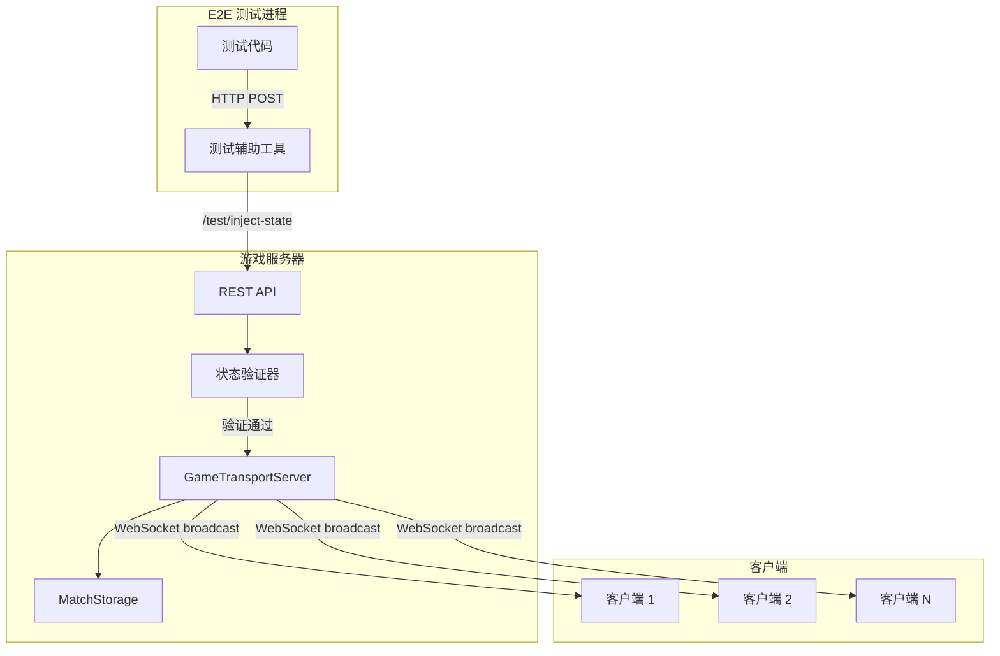

# Design Document: E2E 测试状态注入框架

## Overview

本设计文档描述 E2E 测试状态注入框架的技术实现方案。该框架通过服务器端 API 直接修改对局状态，并自动同步到所有客户端，解决当前 `applyCoreStateDirect` 只修改客户端状态导致的客户端-服务器不一致问题。

核心设计原则：
- **服务器为真实来源**：所有状态注入通过服务器 API 完成，客户端被动接收
- **自动同步**：状态注入后自动广播到所有客户端，无需手动刷新
- **类型安全**：利用 TypeScript 类型系统确保状态结构正确
- **环境隔离**：测试功能仅在测试环境启用，生产环境完全禁用
- **向后兼容**：保留现有 `applyCoreStateDirect` 作为降级方案

## Architecture

### 系统架构图



### 数据流

1. **状态注入流程**
   ```
   测试代码 → injectMatchState(matchId, state)
   → HTTP POST /test/inject-state
   → StateValidator.validate(state)
   → TransportServer.injectState(matchId, state)
   → Storage.setState(matchId, state)
   → TransportServer.broadcastState(match)
   → 所有客户端接收 state:update 事件
   → 客户端更新本地状态并重新渲染
   ```

2. **状态同步流程**
   ```
   服务器状态变更
   → broadcastState(match)
   → 对每个玩家应用 playerView 过滤
   → 通过 WebSocket 发送 state:update 事件
   → 客户端 GameTransportClient 接收事件
   → 更新 React Context 状态
   → 触发组件重新渲染
   ```

## Components and Interfaces

### 1. 服务器端 REST API

#### 端点定义

```typescript
// server/routes/test.ts

/**
 * 测试专用路由（仅在测试环境启用）
 */
export function createTestRoutes(
    transportServer: GameTransportServer,
    storage: MatchStorage
): Router {
    const router = new Router({ prefix: '/test' });

    // 环境检查中间件
    router.use(async (ctx, next) => {
        if (process.env.NODE_ENV !== 'test' && process.env.NODE_ENV !== 'development') {
            ctx.status = 403;
            ctx.body = { error: 'Test endpoints are disabled in production' };
            return;
        }
        await next();
    });

    // 认证中间件（可选，测试环境可能不需要）
    router.use(async (ctx, next) => {
        const token = ctx.headers['x-test-token'];
        if (!token || token !== process.env.TEST_API_TOKEN) {
            ctx.status = 401;
            ctx.body = { error: 'Unauthorized' };
            return;
        }
        await next();
    });

    /**
     * POST /test/inject-state
     * 完整状态注入
     */
    router.post('/inject-state', async (ctx) => {
        const { matchId, state } = ctx.request.body as {
            matchId: string;
            state: MatchState<unknown>;
        };

        if (!matchId || !state) {
            ctx.status = 400;
            ctx.body = { error: 'Missing matchId or state' };
            return;
        }

        try {
            // 验证状态结构
            const validation = await validateMatchState(matchId, state, storage);
            if (!validation.valid) {
                ctx.status = 400;
                ctx.body = { error: 'Invalid state', details: validation.errors };
                return;
            }

            // 注入状态
            await transportServer.injectState(matchId, state);

            // 返回更新后的状态
            const result = await storage.fetch(matchId, { state: true });
            ctx.status = 200;
            ctx.body = { success: true, state: result.state?.G };
        } catch (error) {
            ctx.status = 500;
            ctx.body = { error: 'Internal server error', message: (error as Error).message };
        }
    });

    /**
     * PATCH /test/patch-state
     * 部分状态注入
     */
    router.patch('/patch-state', async (ctx) => {
        const { matchId, patch } = ctx.request.body as {
            matchId: string;
            patch: Partial<MatchState<unknown>>;
        };

        if (!matchId || !patch) {
            ctx.status = 400;
            ctx.body = { error: 'Missing matchId or patch' };
            return;
        }

        try {
            // 获取当前状态
            const current = await storage.fetch(matchId, { state: true });
            if (!current.state) {
                ctx.status = 404;
                ctx.body = { error: 'Match not found' };
                return;
            }

            // 合并状态
            const merged = deepMerge(current.state.G as MatchState<unknown>, patch);

            // 验证合并后的状态
            const validation = await validateMatchState(matchId, merged, storage);
            if (!validation.valid) {
                ctx.status = 400;
                ctx.body = { error: 'Invalid merged state', details: validation.errors };
                return;
            }

            // 注入状态
            await transportServer.injectState(matchId, merged);

            // 返回更新后的状态
            const result = await storage.fetch(matchId, { state: true });
            ctx.status = 200;
            ctx.body = { success: true, state: result.state?.G };
        } catch (error) {
            ctx.status = 500;
            ctx.body = { error: 'Internal server error', message: (error as Error).message };
        }
    });

    /**
     * GET /test/get-state/:matchId
     * 获取当前服务器状态
     */
    router.get('/get-state/:matchId', async (ctx) => {
        const { matchId } = ctx.params;

        try {
            const result = await storage.fetch(matchId, { state: true, metadata: true });
            if (!result.state) {
                ctx.status = 404;
                ctx.body = { error: 'Match not found' };
                return;
            }

            ctx.status = 200;
            ctx.body = {
                state: result.state.G,
                metadata: result.metadata,
                _stateID: result.state._stateID,
            };
        } catch (error) {
            ctx.status = 500;
            ctx.body = { error: 'Internal server error', message: (error as Error).message };
        }
    });

    /**
     * POST /test/snapshot-state
     * 保存状态快照
     */
    router.post('/snapshot-state', async (ctx) => {
        const { matchId } = ctx.request.body as { matchId: string };

        if (!matchId) {
            ctx.status = 400;
            ctx.body = { error: 'Missing matchId' };
            return;
        }

        try {
            const result = await storage.fetch(matchId, { state: true });
            if (!result.state) {
                ctx.status = 404;
                ctx.body = { error: 'Match not found' };
                return;
            }

            // 生成快照 ID
            const snapshotId = `${matchId}_snapshot_${Date.now()}`;

            // 保存快照到临时存储（可以用 Redis 或内存 Map）
            await saveSnapshot(snapshotId, result.state);

            ctx.status = 200;
            ctx.body = { success: true, snapshotId };
        } catch (error) {
            ctx.status = 500;
            ctx.body = { error: 'Internal server error', message: (error as Error).message };
        }
    });

    /**
     * POST /test/restore-state
     * 恢复状态快照
     */
    router.post('/restore-state', async (ctx) => {
        const { matchId, snapshotId } = ctx.request.body as {
            matchId: string;
            snapshotId: string;
        };

        if (!matchId || !snapshotId) {
            ctx.status = 400;
            ctx.body = { error: 'Missing matchId or snapshotId' };
            return;
        }

        try {
            const snapshot = await loadSnapshot(snapshotId);
            if (!snapshot) {
                ctx.status = 404;
                ctx.body = { error: 'Snapshot not found' };
                return;
            }

            // 注入快照状态
            await transportServer.injectState(matchId, snapshot.G as MatchState<unknown>);

            ctx.status = 200;
            ctx.body = { success: true };
        } catch (error) {
            ctx.status = 500;
            ctx.body = { error: 'Internal server error', message: (error as Error).message };
        }
    });

    return router;
}
```

### 2. GameTransportServer 扩展

```typescript
// src/engine/transport/server.ts

export class GameTransportServer {
    // ... 现有代码 ...

    /**
     * 测试专用：直接注入对局状态
     * 
     * 此方法绕过正常的命令执行流程，直接修改服务器状态并广播到所有客户端。
     * 仅在测试环境使用。
     * 
     * @param matchID 对局 ID
     * @param state 新的对局状态
     */
    async injectState(matchID: string, state: MatchState<unknown>): Promise<void> {
        // 环境检查
        if (process.env.NODE_ENV !== 'test' && process.env.NODE_ENV !== 'development') {
            throw new Error('injectState is only available in test/development environment');
        }

        // 加载或获取活跃对局
        let match = this.activeMatches.get(matchID);
        if (!match) {
            match = await this.loadMatch(matchID);
            if (!match) {
                throw new Error(`Match ${matchID} not found`);
            }
            this.activeMatches.set(matchID, match);
        }

        // 更新状态
        match.state = state;

        // 持久化到存储
        const storedState: StoredMatchState = {
            G: state,
            _stateID: (await this.storage.fetch(matchID, { state: true })).state?._stateID ?? 0 + 1,
            randomSeed: match.random ? (match.random as any).seed : undefined,
            randomCursor: match.random ? (match.random as any).getCursor() : undefined,
        };
        await this.storage.setState(matchID, storedState);

        // 广播到所有客户端
        this.broadcastState(match);

        console.log(`[TEST] State injected for match ${matchID}`);
    }
}
```

### 3. 状态验证器

```typescript
// src/engine/transport/stateValidator.ts

export interface ValidationError {
    field: string;
    message: string;
    expected?: unknown;
    actual?: unknown;
}

export interface ValidationResult {
    valid: boolean;
    errors: ValidationError[];
}

/**
 * 验证对局状态的完整性和正确性
 */
export async function validateMatchState(
    matchId: string,
    state: MatchState<unknown>,
    storage: MatchStorage
): Promise<ValidationResult> {
    const errors: ValidationError[] = [];

    // 1. 检查必需字段
    if (!state.sys) {
        errors.push({ field: 'sys', message: 'Missing sys field' });
    }
    if (!state.core) {
        errors.push({ field: 'core', message: 'Missing core field' });
    }

    // 2. 检查 sys 必需字段
    if (state.sys) {
        const sys = state.sys as SystemState;
        
        if (!sys.matchId) {
            errors.push({ field: 'sys.matchId', message: 'Missing matchId' });
        } else if (sys.matchId !== matchId) {
            errors.push({
                field: 'sys.matchId',
                message: 'matchId mismatch',
                expected: matchId,
                actual: sys.matchId,
            });
        }

        if (!sys.turnOrder || !Array.isArray(sys.turnOrder)) {
            errors.push({ field: 'sys.turnOrder', message: 'Missing or invalid turnOrder' });
        }

        if (sys.currentPlayerIndex === undefined || typeof sys.currentPlayerIndex !== 'number') {
            errors.push({ field: 'sys.currentPlayerIndex', message: 'Missing or invalid currentPlayerIndex' });
        }
    }

    // 3. 获取游戏配置并验证游戏特定字段
    const metadata = await storage.fetch(matchId, { metadata: true });
    if (metadata.metadata) {
        const gameId = metadata.metadata.gameName;
        
        // 根据游戏类型进行特定验证
        switch (gameId) {
            case 'smashup':
                validateSmashUpState(state.core, errors);
                break;
            case 'dicethrone':
                validateDiceThroneState(state.core, errors);
                break;
            case 'summonerwars':
                validateSummonerWarsState(state.core, errors);
                break;
        }
    }

    return {
        valid: errors.length === 0,
        errors,
    };
}

/**
 * 验证 SmashUp 状态
 */
function validateSmashUpState(core: unknown, errors: ValidationError[]): void {
    const state = core as Record<string, unknown>;

    if (!state.phase || typeof state.phase !== 'string') {
        errors.push({ field: 'core.phase', message: 'Missing or invalid phase' });
    }

    if (!state.players || typeof state.players !== 'object') {
        errors.push({ field: 'core.players', message: 'Missing or invalid players' });
    }

    if (!state.bases || !Array.isArray(state.bases)) {
        errors.push({ field: 'core.bases', message: 'Missing or invalid bases' });
    }
}

/**
 * 验证 DiceThrone 状态
 */
function validateDiceThroneState(core: unknown, errors: ValidationError[]): void {
    const state = core as Record<string, unknown>;

    if (!state.phase || typeof state.phase !== 'string') {
        errors.push({ field: 'core.phase', message: 'Missing or invalid phase' });
    }

    if (!state.players || typeof state.players !== 'object') {
        errors.push({ field: 'core.players', message: 'Missing or invalid players' });
    }
}

/**
 * 验证 SummonerWars 状态
 */
function validateSummonerWarsState(core: unknown, errors: ValidationError[]): void {
    const state = core as Record<string, unknown>;

    if (!state.phase || typeof state.phase !== 'string') {
        errors.push({ field: 'core.phase', message: 'Missing or invalid phase' });
    }

    if (!state.players || typeof state.players !== 'object') {
        errors.push({ field: 'core.players', message: 'Missing or invalid players' });
    }

    if (!state.board || typeof state.board !== 'object') {
        errors.push({ field: 'core.board', message: 'Missing or invalid board' });
    }
}

/**
 * 深度合并对象（用于部分状态注入）
 */
export function deepMerge<T>(target: T, source: Partial<T>): T {
    const result = { ...target };

    for (const key in source) {
        if (Object.prototype.hasOwnProperty.call(source, key)) {
            const sourceValue = source[key];
            const targetValue = result[key];

            if (
                sourceValue &&
                typeof sourceValue === 'object' &&
                !Array.isArray(sourceValue) &&
                targetValue &&
                typeof targetValue === 'object' &&
                !Array.isArray(targetValue)
            ) {
                result[key] = deepMerge(targetValue, sourceValue as any);
            } else {
                result[key] = sourceValue as any;
            }
        }
    }

    return result;
}
```

### 4. 测试辅助工具

```typescript
// e2e/helpers/state-injection.ts

import { Page } from '@playwright/test';
import { MatchState } from '../../src/core/types';

/**
 * 测试环境配置
 */
const TEST_API_BASE = process.env.TEST_API_BASE || 'http://localhost:18001';
const TEST_API_TOKEN = process.env.TEST_API_TOKEN || 'test-token-12345';

/**
 * 完整状态注入
 * 
 * 通过服务器 API 注入完整的对局状态，并等待客户端同步完成。
 * 
 * @param matchId 对局 ID
 * @param state 新的对局状态
 * @param page 可选的 Page 对象，用于等待客户端同步
 */
export async function injectMatchState(
    matchId: string,
    state: MatchState<unknown>,
    page?: Page
): Promise<void> {
    const response = await fetch(`${TEST_API_BASE}/test/inject-state`, {
        method: 'POST',
        headers: {
            'Content-Type': 'application/json',
            'X-Test-Token': TEST_API_TOKEN,
        },
        body: JSON.stringify({ matchId, state }),
    });

    if (!response.ok) {
        const error = await response.json();
        throw new Error(`State injection failed: ${JSON.stringify(error)}`);
    }

    // 如果提供了 page，等待客户端同步完成
    if (page) {
        await waitForStateSync(page, 5000);
    }
}

/**
 * 部分状态注入
 * 
 * 只修改状态的特定字段，其他字段保持不变。
 * 
 * @param matchId 对局 ID
 * @param patch 要修改的字段
 * @param page 可选的 Page 对象，用于等待客户端同步
 */
export async function patchMatchState(
    matchId: string,
    patch: Partial<MatchState<unknown>>,
    page?: Page
): Promise<void> {
    const response = await fetch(`${TEST_API_BASE}/test/patch-state`, {
        method: 'PATCH',
        headers: {
            'Content-Type': 'application/json',
            'X-Test-Token': TEST_API_TOKEN,
        },
        body: JSON.stringify({ matchId, patch }),
    });

    if (!response.ok) {
        const error = await response.json();
        throw new Error(`State patch failed: ${JSON.stringify(error)}`);
    }

    // 如果提供了 page，等待客户端同步完成
    if (page) {
        await waitForStateSync(page, 5000);
    }
}

/**
 * 获取当前服务器状态
 * 
 * @param matchId 对局 ID
 * @returns 当前服务器状态
 */
export async function getMatchState(matchId: string): Promise<MatchState<unknown>> {
    const response = await fetch(`${TEST_API_BASE}/test/get-state/${matchId}`, {
        headers: {
            'X-Test-Token': TEST_API_TOKEN,
        },
    });

    if (!response.ok) {
        const error = await response.json();
        throw new Error(`Failed to get state: ${JSON.stringify(error)}`);
    }

    const data = await response.json();
    return data.state;
}

/**
 * 等待客户端状态同步完成
 * 
 * 通过监听 WebSocket 消息或轮询状态变化来确认同步完成。
 * 
 * @param page Playwright Page 对象
 * @param timeout 超时时间（毫秒）
 */
export async function waitForStateSync(page: Page, timeout = 5000): Promise<void> {
    // 方案 1：等待 state:update 事件（需要在客户端注入监听器）
    // 方案 2：轮询状态变化
    // 方案 3：等待固定时间（最简单但不可靠）

    // 这里使用方案 3 作为初始实现，后续可以优化为方案 1
    await page.waitForTimeout(500);

    // TODO: 实现更可靠的同步检测机制
    // 可以在客户端注入一个全局标志，当收到 state:update 时设置为 true
    // 然后在这里轮询该标志
}

/**
 * 保存状态快照
 * 
 * @param matchId 对局 ID
 * @returns 快照 ID
 */
export async function snapshotMatchState(matchId: string): Promise<string> {
    const response = await fetch(`${TEST_API_BASE}/test/snapshot-state`, {
        method: 'POST',
        headers: {
            'Content-Type': 'application/json',
            'X-Test-Token': TEST_API_TOKEN,
        },
        body: JSON.stringify({ matchId }),
    });

    if (!response.ok) {
        const error = await response.json();
        throw new Error(`Snapshot failed: ${JSON.stringify(error)}`);
    }

    const data = await response.json();
    return data.snapshotId;
}

/**
 * 恢复状态快照
 * 
 * @param matchId 对局 ID
 * @param snapshotId 快照 ID
 * @param page 可选的 Page 对象，用于等待客户端同步
 */
export async function restoreMatchState(
    matchId: string,
    snapshotId: string,
    page?: Page
): Promise<void> {
    const response = await fetch(`${TEST_API_BASE}/test/restore-state`, {
        method: 'POST',
        headers: {
            'Content-Type': 'application/json',
            'X-Test-Token': TEST_API_TOKEN,
        },
        body: JSON.stringify({ matchId, snapshotId }),
    });

    if (!response.ok) {
        const error = await response.json();
        throw new Error(`Restore failed: ${JSON.stringify(error)}`);
    }

    // 如果提供了 page，等待客户端同步完成
    if (page) {
        await waitForStateSync(page, 5000);
    }
}

/**
 * 启用状态注入调试日志
 * 
 * 设置环境变量以启用详细的调试日志。
 */
export function enableStateInjectionDebugLog(): void {
    process.env.DEBUG_STATE_INJECTION = 'true';
}
```

### 5. 快照存储

```typescript
// server/storage/snapshotStorage.ts

import { StoredMatchState } from '../../src/engine/transport/storage';

/**
 * 快照存储（内存实现，测试环境使用）
 */
class SnapshotStorage {
    private snapshots: Map<string, StoredMatchState> = new Map();

    async save(snapshotId: string, state: StoredMatchState): Promise<void> {
        this.snapshots.set(snapshotId, JSON.parse(JSON.stringify(state)));
    }

    async load(snapshotId: string): Promise<StoredMatchState | undefined> {
        const snapshot = this.snapshots.get(snapshotId);
        return snapshot ? JSON.parse(JSON.stringify(snapshot)) : undefined;
    }

    async delete(snapshotId: string): Promise<void> {
        this.snapshots.delete(snapshotId);
    }

    async clear(): Promise<void> {
        this.snapshots.clear();
    }
}

export const snapshotStorage = new SnapshotStorage();

export async function saveSnapshot(snapshotId: string, state: StoredMatchState): Promise<void> {
    await snapshotStorage.save(snapshotId, state);
}

export async function loadSnapshot(snapshotId: string): Promise<StoredMatchState | undefined> {
    return await snapshotStorage.load(snapshotId);
}

export async function deleteSnapshot(snapshotId: string): Promise<void> {
    await snapshotStorage.delete(snapshotId);
}

export async function clearSnapshots(): Promise<void> {
    await snapshotStorage.clear();
}
```

## Data Models

### MatchState 结构

```typescript
// src/core/types.ts

/**
 * 对局状态（框架层）
 */
export interface MatchState<TCore> {
    /** 系统状态（引擎管理） */
    sys: SystemState;
    /** 游戏核心状态（游戏特定） */
    core: TCore;
}

/**
 * 系统状态
 */
export interface SystemState {
    /** 对局 ID */
    matchId: string;
    /** 回合顺序 */
    turnOrder: PlayerId[];
    /** 当前玩家索引 */
    currentPlayerIndex: number;
    /** 游戏结束状态 */
    gameover?: GameOverResult;
    /** 交互系统状态 */
    interaction?: InteractionState;
    /** 事件流系统状态 */
    eventstream?: EventStreamState;
    /** 其他系统状态 */
    [key: string]: unknown;
}
```

### 状态注入请求/响应

```typescript
// 状态注入请求
interface InjectStateRequest {
    matchId: string;
    state: MatchState<unknown>;
}

// 状态注入响应
interface InjectStateResponse {
    success: boolean;
    state?: MatchState<unknown>;
    error?: string;
    details?: ValidationError[];
}

// 部分状态注入请求
interface PatchStateRequest {
    matchId: string;
    patch: Partial<MatchState<unknown>>;
}

// 获取状态响应
interface GetStateResponse {
    state: MatchState<unknown>;
    metadata: MatchMetadata;
    _stateID: number;
}

// 快照请求/响应
interface SnapshotRequest {
    matchId: string;
}

interface SnapshotResponse {
    success: boolean;
    snapshotId: string;
}

interface RestoreRequest {
    matchId: string;
    snapshotId: string;
}

interface RestoreResponse {
    success: boolean;
}
```

## Correctness Properties

*A property is a characteristic or behavior that should hold true across all valid executions of a system-essentially, a formal statement about what the system should do. Properties serve as the bridge between human-readable specifications and machine-verifiable correctness guarantees.*


### Property 1: 状态注入接口正确性
*For any* 有效的 matchId 和 Match_State 对象，调用状态注入 API 应该返回成功响应（HTTP 200），并且服务器状态应该与注入的状态完全一致。
**Validates: Requirements 1.1, 1.2, 1.6**

### Property 2: 部分状态注入保留未修改字段
*For any* 对局和部分状态 patch，执行部分状态注入后，只有 patch 中指定的字段应该被修改，其他字段应该保持与注入前完全一致。
**Validates: Requirements 1.3**

### Property 3: 无效状态被拒绝
*For any* 缺少必需字段或类型错误的状态，状态注入 API 应该返回 HTTP 400 错误，并且错误响应应该包含详细的错误信息（错误类型、字段路径、期望值、实际值）。
**Validates: Requirements 1.4, 1.5, 1.7, 7.1**

### Property 4: 验证器列出所有错误
*For any* 包含多个验证错误的状态，状态验证器应该返回所有验证失败的字段，而不是只返回第一个错误。
**Validates: Requirements 7.2**

### Property 5: 状态注入后客户端-服务器一致性
*For any* 对局和注入的状态，当状态注入成功后，所有连接的客户端应该通过 WebSocket 接收到 state:update 事件，并且客户端的本地状态应该与服务器状态完全一致。
**Validates: Requirements 2.1, 2.2**

### Property 6: 状态同步失败不阻塞 API
*For any* 对局，即使 WebSocket 广播失败（如客户端断开连接），状态注入 API 仍然应该返回成功响应，并且错误应该被记录到日志中。
**Validates: Requirements 2.4**

### Property 7: 断线重连获取最新状态
*For any* 对局，当客户端断开连接后重新连接时，客户端应该从服务器获取最新状态，并且该状态应该与服务器当前状态一致。
**Validates: Requirements 2.5**

### Property 8: 测试工具函数错误处理
*For any* 测试工具函数（injectMatchState、patchMatchState、getMatchState 等），当传入无效参数（如不存在的 matchId）时，函数应该抛出异常，并且异常消息应该包含详细的错误信息。
**Validates: Requirements 3.7**

### Property 9: 游戏特定验证规则
*For any* 游戏（SmashUp、DiceThrone、SummonerWars），当注入该游戏的状态时，状态验证器应该使用该游戏特定的验证规则，并且应该正确验证游戏特有的字段。
**Validates: Requirements 5.4, 5.5**

### Property 10: 并发请求无竞态条件
*For any* 对局，当并发执行多个状态注入请求时，最终的服务器状态应该是一致的，不应该出现数据丢失或损坏。
**Validates: Requirements 6.3**

### Property 11: 状态注入原子性
*For any* 对局，当状态注入操作失败时（如验证失败），服务器状态应该保持不变，不应该出现部分修改的情况。
**Validates: Requirements 6.4**

## Error Handling

### 错误分类

1. **客户端错误（HTTP 400）**
   - 缺少必需参数（matchId、state）
   - 状态结构无效（缺少必需字段、类型错误）
   - matchId 不匹配（state.sys.matchId ≠ 请求中的 matchId）

2. **认证错误（HTTP 401/403）**
   - 缺少认证令牌（401）
   - 认证令牌无效（403）
   - 生产环境禁用测试 API（403）

3. **资源不存在（HTTP 404）**
   - 对局不存在
   - 快照不存在

4. **服务器错误（HTTP 500）**
   - 存储层错误
   - WebSocket 广播错误（不阻塞响应，记录日志）
   - 未预期的异常

### 错误响应格式

```typescript
interface ErrorResponse {
    error: string;              // 错误类型（简短描述）
    message?: string;           // 详细错误消息
    details?: ValidationError[]; // 验证错误详情（仅验证失败时）
}

interface ValidationError {
    field: string;    // 错误字段路径（如 'sys.matchId'）
    message: string;  // 错误描述
    expected?: unknown; // 期望值
    actual?: unknown;   // 实际值
}
```

### 错误处理策略

1. **验证失败**：立即返回 400 错误，不修改服务器状态
2. **存储失败**：返回 500 错误，记录详细日志
3. **广播失败**：不阻塞 API 响应，记录错误日志，客户端通过重连获取最新状态
4. **并发冲突**：使用 _stateID 版本号检测冲突，后到的请求覆盖前面的请求（Last Write Wins）

### 日志记录

```typescript
// 成功日志
console.log(`[TEST] State injected for match ${matchId}`);

// 验证失败日志
console.warn(`[TEST] State validation failed for match ${matchId}:`, errors);

// 广播失败日志
console.error(`[TEST] Failed to broadcast state for match ${matchId}:`, {
    matchId,
    clientId,
    error: error.message,
    stack: error.stack,
});

// 调试日志（启用时）
if (process.env.DEBUG_STATE_INJECTION === 'true') {
    console.debug(`[TEST] State injection request:`, { matchId, state });
    console.debug(`[TEST] State injection response:`, { success: true, state });
}
```

## Testing Strategy

### 测试层级

1. **单元测试（Vitest）**
   - 状态验证器测试（validateMatchState）
   - 深度合并函数测试（deepMerge）
   - 游戏特定验证规则测试（validateSmashUpState 等）
   - 快照存储测试（SnapshotStorage）

2. **集成测试（Vitest + 模拟服务器）**
   - REST API 端点测试
   - GameTransportServer.injectState 测试
   - 状态同步机制测试
   - 错误处理测试

3. **E2E 测试（Playwright）**
   - 完整状态注入流程测试
   - 客户端-服务器同步测试
   - 跨游戏兼容性测试
   - 测试工具函数集成测试

### 属性测试配置

所有属性测试使用 fast-check 库，每个测试运行 100 次迭代。

```typescript
// 示例：属性测试配置
import fc from 'fast-check';

describe('Property 1: 状态注入接口正确性', () => {
    it('should accept valid matchId and state', async () => {
        await fc.assert(
            fc.asyncProperty(
                fc.string({ minLength: 1 }), // matchId
                arbitraryMatchState(),        // state
                async (matchId, state) => {
                    // Feature: e2e-state-injection-framework, Property 1: 状态注入接口正确性
                    const response = await injectMatchState(matchId, state);
                    expect(response.status).toBe(200);
                    
                    const serverState = await getMatchState(matchId);
                    expect(serverState).toEqual(state);
                }
            ),
            { numRuns: 100 }
        );
    });
});
```

### 测试数据生成器

```typescript
// 生成随机 MatchState
function arbitraryMatchState(): fc.Arbitrary<MatchState<unknown>> {
    return fc.record({
        sys: fc.record({
            matchId: fc.string({ minLength: 1 }),
            turnOrder: fc.array(fc.integer({ min: 0, max: 1 }), { minLength: 2, maxLength: 2 }),
            currentPlayerIndex: fc.integer({ min: 0, max: 1 }),
        }),
        core: fc.record({
            phase: fc.constantFrom('setup', 'play', 'end'),
            players: fc.dictionary(
                fc.integer({ min: 0, max: 1 }).map(String),
                fc.record({
                    hp: fc.integer({ min: 0, max: 100 }),
                    hand: fc.array(fc.string()),
                })
            ),
        }),
    });
}

// 生成无效状态（缺少必需字段）
function arbitraryInvalidState(): fc.Arbitrary<Partial<MatchState<unknown>>> {
    return fc.oneof(
        fc.record({ sys: fc.constant(undefined), core: fc.anything() }), // 缺少 sys
        fc.record({ sys: fc.anything(), core: fc.constant(undefined) }), // 缺少 core
        fc.record({ sys: fc.record({ matchId: fc.constant(undefined) }), core: fc.anything() }), // 缺少 matchId
    );
}
```

### 测试覆盖目标

- **单元测试**：代码覆盖率 > 90%
- **集成测试**：覆盖所有 API 端点和错误场景
- **E2E 测试**：覆盖所有用户场景和跨游戏兼容性
- **属性测试**：每个属性至少 100 次迭代

### 测试环境配置

```bash
# .env.test
NODE_ENV=test
TEST_API_BASE=http://localhost:18001
TEST_API_TOKEN=test-token-12345
DEBUG_STATE_INJECTION=false

# 启用调试日志
DEBUG_STATE_INJECTION=true npm run test:e2e
```

### 迁移策略

1. **阶段 1：实现新框架**
   - 实现服务器端 API
   - 实现测试工具函数
   - 编写单元测试和集成测试

2. **阶段 2：并行运行**
   - 保留 `applyCoreStateDirect`（标记为 deprecated）
   - 新测试使用 `injectMatchState`
   - 现有测试继续使用旧 API

3. **阶段 3：逐步迁移**
   - 逐个迁移现有测试到新 API
   - 验证迁移后的测试通过
   - 更新测试文档

4. **阶段 4：移除旧 API**
   - 所有测试迁移完成后
   - 移除 `applyCoreStateDirect`
   - 更新文档

### 性能监控

虽然性能测试不作为自动化测试的一部分，但应该在开发过程中监控以下指标：

- 状态注入 API 响应时间（目标 < 100ms）
- WebSocket 广播延迟（目标 < 50ms）
- 并发请求处理能力（目标 > 10 req/s）
- 内存使用（快照存储）

可以使用以下工具进行性能监控：
- `console.time` / `console.timeEnd` 测量关键操作耗时
- Playwright 的 `page.evaluate` 测量客户端同步延迟
- 压力测试工具（如 k6）测试并发性能

## 总结

本设计文档描述了 E2E 测试状态注入框架的完整技术方案，包括：

1. **服务器端 REST API**：提供 `/test/inject-state`、`/test/patch-state`、`/test/get-state` 等端点
2. **GameTransportServer 扩展**：添加 `injectState` 方法，支持直接修改对局状态并自动广播
3. **状态验证器**：验证状态结构完整性和游戏特定字段
4. **测试辅助工具**：提供 `injectMatchState`、`patchMatchState`、`getMatchState` 等函数
5. **快照存储**：支持状态快照和恢复
6. **环境隔离**：测试功能仅在测试环境启用，生产环境完全禁用
7. **向后兼容**：保留现有 `applyCoreStateDirect` 作为降级方案

该框架解决了当前 E2E 测试中客户端-服务器状态不同步的问题，提供了可靠、高效、类型安全的测试状态管理能力。

**这样能不能支持未来 100 个游戏？**

✅ **能**。设计遵循以下原则：
- **游戏无关的核心框架**：状态注入 API、同步机制、测试工具函数都是游戏无关的
- **可扩展的验证规则**：通过 `validateXxxState` 函数支持游戏特定验证，新增游戏只需添加对应的验证函数
- **统一的接口**：所有游戏使用相同的 `MatchState<TCore>` 结构，只有 `core` 部分是游戏特定的
- **类型安全**：利用 TypeScript 泛型确保类型正确，新增游戏时编译器会自动检查
