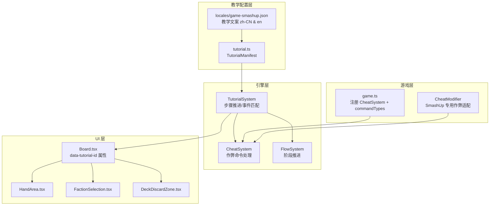

# Design Document: Smash Up Tutorial System

## Overview

为大杀四方 (Smash Up) 实现完整的教学系统，引导新玩家从派系选择到完整回合流程。教学采用与召唤师战争 (Summoner Wars) 相同的 TutorialManifest 模式：通过 AI 自动操作设置固定场景，逐步高亮 UI 元素讲解概念，并在关键操作处让玩家亲手操作。

教学选用恐龙 (Dinosaurs) + 海盗 (Pirates) 作为玩家派系（简单直观的力量型 + 移动型），对手使用机器人 (Robots) + 巫师 (Wizards)。通过 Cheat 命令发放特定手牌，确保教学流程可控。

## Architecture



### 设计决策

1. **派系选择**：教学使用恐龙+海盗（玩家）vs 机器人+巫师（对手），因为恐龙随从力量高且能力简单，海盗有移动能力便于演示，整体概念直观。
2. **CheatSystem 集成**：需要在 `game.ts` 中注册 `createCheatSystem` 并实现 `CheatResourceModifier`，因为 smashup 的 `CardInstance` 结构与 summonerwars 不同（使用 `defId` 而非 `spriteIndex`），需要按 `defId` 查找牌库中的卡牌。
3. **教学步骤约 20 步**：比 summonerwars 的 32 步精简，因为 smashup 的阶段更线性（无棋盘移动），重点放在出牌和记分概念上。
4. **固定随机策略**：使用 `randomPolicy: { mode: 'fixed', values: [1] }` 确保洗牌和抽牌结果一致。

## Components and Interfaces

### 1. Tutorial Manifest (`src/games/smashup/tutorial.ts`)

重写现有的 2 步 stub，扩展为完整教学。导入类型从 `../../engine/types` 而非 `../../contexts/TutorialContext`（与 summonerwars 保持一致）。

```typescript
import type { TutorialManifest } from '../../engine/types';
import { SU_COMMANDS, SU_EVENTS } from './domain/types';
import { FLOW_COMMANDS, FLOW_EVENTS } from '../../engine/systems/FlowSystem';
import { CHEAT_COMMANDS } from '../../engine/systems/CheatSystem';

const MATCH_PHASE_PLAY = { type: FLOW_EVENTS.PHASE_CHANGED, match: { to: 'playCards' } };
const MATCH_PHASE_DRAW = { type: FLOW_EVENTS.PHASE_CHANGED, match: { to: 'draw' } };

const SMASH_UP_TUTORIAL: TutorialManifest = {
    id: 'smashup-basic',
    randomPolicy: { mode: 'fixed', values: [1] },
    steps: [
        // Step 0: 初始化 - AI 选派系 + 作弊设置手牌
        // Step 1: 欢迎 - 高亮基地区域
        // Step 2: 记分板介绍 - 高亮记分板
        // Step 3: 手牌介绍 - 高亮手牌区
        // Step 4: 回合追踪器 - 高亮回合/阶段
        // Step 5: 出牌阶段说明
        // Step 6: 打出随从 - 玩家操作
        // Step 7: 打出行动 - 玩家操作
        // Step 8: 天赋说明
        // Step 9: 结束出牌 - 点击结束按钮
        // Step 10: 基地记分概念
        // Step 11: VP 奖励说明
        // Step 12: 抽牌阶段说明
        // Step 13: 手牌上限说明
        // Step 14: 结束抽牌
        // Step 15: 对手回合 - AI 自动执行
        // Step 16: 回合循环说明
        // Step 17: 教学总结
        // Step 18: 完成
    ],
};
```

### 2. CheatResourceModifier (`src/games/smashup/cheatModifier.ts`)

新建文件，实现 SmashUp 专用的作弊适配器。

```typescript
import type { CheatResourceModifier } from '../../engine/systems/CheatSystem';
import type { SmashUpCore } from './domain/types';

export const smashUpCheatModifier: CheatResourceModifier<SmashUpCore> = {
    getResource: (core, playerId, resourceId) => {
        if (resourceId === 'vp') return core.players[playerId]?.vp;
        return undefined;
    },
    setResource: (core, playerId, resourceId, value) => {
        if (resourceId === 'vp') {
            const player = core.players[playerId];
            if (!player) return core;
            return {
                ...core,
                players: { ...core.players, [playerId]: { ...player, vp: value } },
            };
        }
        return core;
    },
    dealCardByIndex: (core, playerId, deckIndex) => {
        const player = core.players[playerId];
        if (!player || deckIndex < 0 || deckIndex >= player.deck.length) return core;
        const newDeck = [...player.deck];
        const [card] = newDeck.splice(deckIndex, 1);
        return {
            ...core,
            players: {
                ...core.players,
                [playerId]: { ...player, deck: newDeck, hand: [...player.hand, card] },
            },
        };
    },
    // dealCardByAtlasIndex 和 dealCardToDiscard 需要按 defId 匹配
    // SmashUp 的 CardInstance 使用 defId 而非 spriteIndex
};
```

### 3. Board UI data-tutorial-id 属性

在 Board.tsx 及子组件中添加以下 `data-tutorial-id` 属性：

| data-tutorial-id | 组件 | 位置 |
|---|---|---|
| `su-base-area` | Board.tsx | 基地滚动区域容器 |
| `su-scoreboard` | Board.tsx | 右上角记分板 |
| `su-turn-tracker` | Board.tsx | 左上角回合追踪器 |
| `su-hand-area` | Board.tsx | 底部手牌区容器 |
| `su-end-turn-btn` | Board.tsx | 结束回合按钮 |
| `su-deck-discard` | DeckDiscardZone.tsx | 牌库/弃牌区 |
| `su-faction-select` | FactionSelection.tsx | 派系选择界面 |

### 4. game.ts 修改

```typescript
import { createCheatSystem, CHEAT_COMMANDS } from '../../engine/systems/CheatSystem';
import { smashUpCheatModifier } from './cheatModifier';

const systems = [
    createFlowSystem<SmashUpCore>({ hooks: smashUpFlowHooks }),
    ...createDefaultSystems<SmashUpCore>(),
    createSmashUpPromptBridge(),
    createCheatSystem<SmashUpCore>(smashUpCheatModifier), // 新增
];

// commandTypes 中新增 CHEAT_COMMANDS
commandTypes: [
    ...Object.values(SU_COMMANDS),
    'RESPONSE_PASS',
    PROMPT_COMMANDS.RESPOND,
    CHEAT_COMMANDS.SET_RESOURCE,
    CHEAT_COMMANDS.DEAL_CARD_BY_INDEX,
    CHEAT_COMMANDS.SET_STATE,
    CHEAT_COMMANDS.MERGE_STATE,
],
```

### 5. 教学文案结构 (i18n)

```json
{
  "tutorial": {
    "title": "大杀四方教学",
    "steps": {
      "setup": "正在准备教学场景...",
      "welcome": "欢迎来到大杀四方！在这个游戏中，你将选择两个派系混搭组成牌库，争夺场上的基地来获取胜利分数。先到 15 VP 的玩家获胜！",
      "scoreboard": "这是记分板，显示每位玩家的胜利分数 (VP) 和所选派系。",
      "handIntro": "这是你的手牌区。你的牌库由两个派系的卡牌混合而成，包含随从卡和行动卡。",
      "turnTracker": "这里显示当前回合数和游戏阶段。每回合依次经过：出牌 → 记分 → 抽牌。",
      "playCardsExplain": "现在是出牌阶段！每回合你可以打出 1 张随从和 1 张行动卡。随从放在基地上贡献力量，行动卡执行特殊效果。",
      "playMinion": "试试打出一张随从吧！点击手牌中的随从卡，然后选择一个基地放置。",
      "playAction": "很好！现在打出一张行动卡。点击手牌中的行动卡即可使用。",
      "talentIntro": "有些随从拥有天赋能力，每回合可以使用一次。留意随从卡上的天赋标记！",
      "endPlayCards": "出牌完成！点击右侧的结束按钮进入下一阶段。",
      "baseScoring": "基地记分：当一个基地上所有随从的力量总和达到临界点时，该基地就会记分。",
      "vpAwards": "记分时，力量排名前三的玩家分别获得基地卡上标注的 VP 奖励。力量最高的玩家获得最多 VP！",
      "drawExplain": "抽牌阶段：每回合结束前你会抽 2 张牌。",
      "handLimit": "注意手牌上限是 10 张。如果抽牌后超过上限，你需要弃掉多余的牌。",
      "endDraw": "点击结束按钮完成抽牌阶段。",
      "opponentTurn": "现在是对手的回合，观察对手的操作...",
      "turnCycle": "回合交替进行。利用每回合的出牌机会，在基地上积累力量优势！",
      "summary": "教学完成！核心要点：选 2 派系混搭牌库 → 每回合出 1 随从 + 1 行动 → 基地力量达临界点时记分 → 先到 15 VP 获胜。祝你游戏愉快！",
      "finish": "你已经掌握了大杀四方的基本规则，准备好大杀四方了吗？"
    }
  }
}
```

## Data Models

### TutorialManifest 配置

教学使用现有的 `TutorialManifest` 和 `TutorialStepSnapshot` 类型，无需新增数据模型。

关键配置字段使用：
- `aiActions`: 自动选派系、设置手牌、执行对手回合
- `highlightTarget`: 高亮 UI 元素（通过 `data-tutorial-id`）
- `allowedCommands` / `blockedCommands`: 控制玩家可执行的操作
- `advanceOnEvents`: 监听游戏事件自动推进步骤
- `randomPolicy`: 固定随机种子确保可复现

### CheatModifier 数据流

```
教学步骤 aiActions
  → CHEAT_COMMANDS.MERGE_STATE { payload: { players: { '0': { hand: [...specificCards] } } } }
  → CheatSystem 处理
  → 游戏状态更新（玩家手牌被替换为教学指定的卡牌）
```

使用 `MERGE_STATE` 而非 `DEAL_CARD_BY_ATLAS_INDEX` 的原因：SmashUp 的 `CardInstance` 不使用 `spriteIndex`（与 SummonerWars 不同），直接合并状态更简单可靠。


## Correctness Properties

*A property is a characteristic or behavior that should hold true across all valid executions of a system — essentially, a formal statement about what the system should do. Properties serve as the bridge between human-readable specifications and machine-verifiable correctness guarantees.*

### Property 1: UI introduction steps block phase advancement

*For any* tutorial step that is a UI introduction step (non-action, non-setup step with `requireAction: false`), the step's `blockedCommands` array SHALL contain `ADVANCE_PHASE`, preventing the player from skipping the explanation.

**Validates: Requirements 2.6**

### Property 2: Cheat dealCardByIndex preserves deck integrity

*For any* valid SmashUpCore state and valid deck index, issuing a `dealCardByIndex` cheat command SHALL move exactly one card from the player's deck at the specified index to the end of the player's hand, reducing deck length by 1 and increasing hand length by 1, while preserving all other player state.

**Validates: Requirements 10.3**

### Property 3: Tutorial i18n completeness

*For any* tutorial step in the manifest, the `content` field SHALL be a valid i18n key matching the pattern `game-smashup:tutorial.*`, and the corresponding translation SHALL exist in both `zh-CN` and `en` locale files.

**Validates: Requirements 11.1, 11.2**

## Error Handling

| 场景 | 处理方式 |
|---|---|
| CheatSystem 未注册但教学使用作弊命令 | 引擎层忽略未知命令，教学步骤不会崩溃但状态不会改变 |
| data-tutorial-id 属性缺失 | 教学框架的高亮功能静默失败（不显示高亮），教学文案仍正常显示 |
| 教学中玩家执行了非 allowedCommands 的操作 | TutorialSystem 拦截并阻止命令执行 |
| i18n key 缺失 | react-i18next 回退显示 key 本身，不会崩溃 |
| 固定随机策略下牌库顺序异常 | randomPolicy 确保每次教学的洗牌结果一致，若游戏逻辑变更导致不一致，教学流程可能偏离预期但不会崩溃 |

## Testing Strategy

### 单元测试

- **Tutorial manifest 结构验证**：验证每个步骤的 id 唯一性、content 格式、aiActions 结构正确性
- **CheatModifier 功能测试**：测试 `dealCardByIndex`、`setResource` 等具体操作的正确性
- **data-tutorial-id 存在性**：渲染 Board 组件并验证关键 DOM 元素包含预期的 `data-tutorial-id` 属性

### 属性测试

使用 `fast-check` 库进行属性测试，每个属性至少运行 100 次迭代。

- **Property 1**: 遍历 manifest 中所有 `requireAction: false` 且非 setup/finish 的步骤，验证 `blockedCommands` 包含 `ADVANCE_PHASE`
  - Tag: **Feature: smashup-tutorial, Property 1: UI introduction steps block phase advancement**

- **Property 2**: 生成随机 SmashUpCore 状态（随机手牌/牌库），随机选择有效 deck index，执行 dealCardByIndex，验证牌从 deck 移到 hand
  - Tag: **Feature: smashup-tutorial, Property 2: Cheat dealCardByIndex preserves deck integrity**

- **Property 3**: 遍历 manifest 所有步骤，验证 content 匹配 i18n key 模式且在两个 locale 文件中都存在
  - Tag: **Feature: smashup-tutorial, Property 3: Tutorial i18n completeness**

### E2E 测试

- 使用 Playwright 验证教学流程可从头到尾完成
- 验证高亮元素在对应步骤正确显示
- 验证 AI 自动操作（派系选择、对手回合）正确执行
