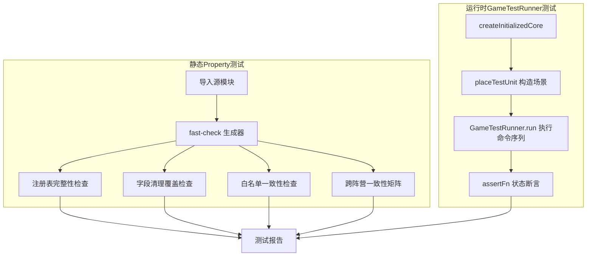
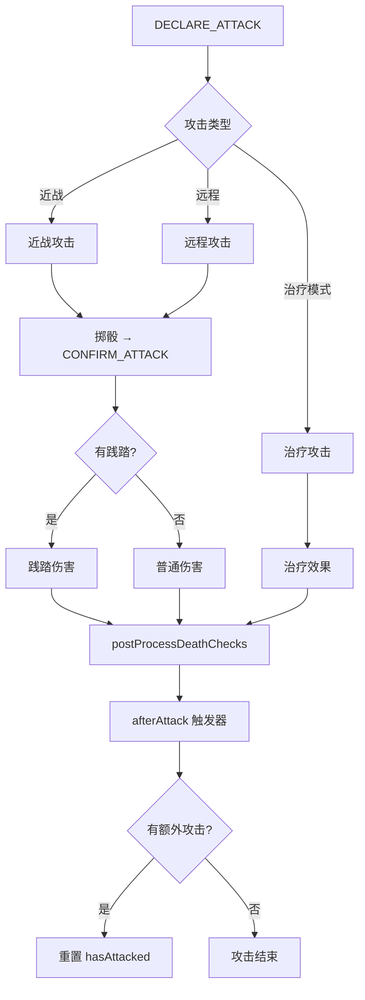

# 设计文档：召唤师战争 D11-D33 维度审计

## 概述

本设计文档描述召唤师战争（summonerwars）D11-D33 维度审计的技术方案。审计采用双轨策略：

1. **静态 Property 测试**：导入源模块 + fast-check，验证注册表完整性、字段清理覆盖、白名单一致性、跨阵营一致性
2. **运行时 GameTestRunner 行为测试**：命令序列 + 状态断言，验证组合场景（D19）、触发频率（D21）、架构绕过（D23）、消灭时序（D30）、替代路径（D32）

审计范围覆盖 16 个需求，涉及 reduce.ts、validate.ts、execute.ts、flowHooks.ts、helpers.ts、abilities-*.ts 等核心领域文件。

## 架构

### 审计双轨架构



### 测试文件组织

```
src/games/summonerwars/__tests__/
├── d11-reducer-consumption.property.test.ts    # D11 Reducer消耗路径
├── d12-write-consume-symmetry.property.test.ts # D12 写入-消耗对称
├── d14-turn-cleanup.property.test.ts           # D14 回合清理完整性
├── d16-d17-condition-priority.test.ts          # D16+D17 条件优先级
├── d18-negation-path.test.ts                   # D18 否定路径
├── d19-combination-scenarios.test.ts           # D19 组合场景（GameTestRunner）
├── d21-trigger-frequency.test.ts               # D21 触发频率门控
├── d23-architecture-bypass.test.ts             # D23 架构假设一致性
├── d25-d27-matchstate-optional.test.ts         # D25+D27 MatchState传播
├── d28-whitelist-completeness.property.test.ts # D28 白名单完整性
├── d30-destruction-timing.test.ts              # D30 消灭流程时序
├── d31-effect-interception.test.ts             # D31 效果拦截路径
├── d32-alternative-path.test.ts                # D32 替代路径后处理
├── d33-cross-faction-consistency.property.test.ts # D33 跨阵营一致性
├── d13-multi-source-competition.test.ts        # D13 多来源竞争
└── d15-ui-state-sync.test.ts                   # D15 UI状态同步
```

## 组件与接口

### 1. 静态 Property 测试组件

**依赖模块**：
- `fast-check`：属性测试框架，生成随机输入
- `abilityRegistry`（`domain/abilities.ts`）：技能注册表，提供 `getAll()`、`getByTrigger()` 等查询
- `reduceEvent`（`domain/reduce.ts`）：事件处理器
- `CONFIRMABLE_PHASE_END_ABILITIES`（`domain/flowHooks.ts`）：阶段结束技能白名单
- `BoardUnit`/`PlayerState` 类型（`domain/types.ts`）：状态字段定义

**Property 测试模式**：
```typescript
import * as fc from 'fast-check';
import { abilityRegistry } from '../domain/abilities';

it('Property N: ...', () => {
  fc.assert(fc.property(
    generator,
    (input) => {
      // 断言
    }
  ), { numRuns: 100 });
});
```

### 2. 运行时 GameTestRunner 组件

**依赖模块**：
- `GameTestRunner`（`engine/testing/GameTestRunner.ts`）：命令序列执行 + 状态断言
- `createInitializedCore`（`__tests__/test-helpers.ts`）：创建已选阵营的初始状态
- `placeTestUnit`（`__tests__/test-helpers.ts`）：在指定位置放置测试单位
- `SummonerWarsDomain`（`domain/index.ts`）：领域定义
- `createInitialSystemState`（`engine/pipeline.ts`）：创建引擎系统初始状态

**GameTestRunner 测试模式**：
```typescript
const runner = new GameTestRunner({
  domain: SummonerWarsDomain,
  playerIds: ['0', '1'],
  setup: (playerIds, random) => {
    const core = createInitializedCore(playerIds, random, { faction0, faction1 });
    // placeTestUnit 构造特定场景
    return { core, sys: createInitialSystemState(playerIds, [], undefined) };
  },
  assertFn: (state, expect) => {
    // 自定义状态断言
  },
});
```

### 3. 关键源模块接口

| 模块 | 关键接口 | 审计用途 |
|------|----------|----------|
| `reduce.ts` | `reduceEvent(core, event)` | D11/D12/D14：验证事件处理分支 |
| `validate.ts` | `validateCommand(state, command, playerId)` | D16/D23：验证条件优先级和架构绕过 |
| `execute.ts` | 攻击流程（DECLARE_ATTACK → CONFIRM_ATTACK） | D32：验证替代路径后处理 |
| `flowHooks.ts` | `onPhaseExit`/`onPhaseEnter`/`CONFIRMABLE_PHASE_END_ABILITIES` | D17/D28：验证阶段触发器和白名单 |
| `helpers.ts` | `getUnitAbilities`/`canMoveToEnhanced`/`getUnitMoveEnhancements` | D23：验证架构假设 |
| `abilityResolver.ts` | `triggerAbilities`/`resolveAbilityEffects`/`getEffectiveStrengthValue`/`getEffectiveLife` | D15/D21/D33：UI同步、触发频率、跨阵营一致性 |
| `abilities-*.ts` | 各阵营 `AbilityDef[]` 导出 | D33：跨阵营能力定义比对 |

## 数据模型

### 审计关注的核心状态字段

**BoardUnit 临时字段**（D14 回合清理目标）：
- `hasMoved: boolean` — 本回合是否已移动
- `hasAttacked: boolean` — 本回合是否已攻击
- `extraAttacks?: number` — 额外攻击次数
- `tempAbilities?: string[]` — 临时技能（幻化复制）
- `healingMode?: boolean` — 治疗模式
- `wasAttackedThisTurn?: boolean` — 本回合是否被攻击
- `originalOwner?: PlayerId` — 心灵操控原始拥有者

**PlayerState 回合字段**（D14 回合清理目标）：
- `moveCount: number` — 本回合已移动次数
- `attackCount: number` — 本回合已攻击次数
- `hasAttackedEnemy: boolean` — 本回合是否攻击过敌方

**SummonerWarsCore 回合字段**（D14 回合清理目标）：
- `abilityUsageCount: Record<string, number>` — 技能使用次数
- `unitKillCountThisTurn?: Record<string, number>` — 单位击杀计数

### 攻击流程路径（D32 替代路径分析）



### 跨阵营能力语义分类（D33）

| 语义类别 | 代表能力 | 涉及阵营 |
|----------|----------|----------|
| 直接伤害 | `ice_shards`/`soul_transfer`/`goblin_frenzy` | 冰霜/亡灵/哥布林 |
| 治疗 | `healing`/`funeral_pyre` | 圣骑/亡灵 |
| 额外移动 | `flying`/`swift`/`climb` | 多阵营 |
| 额外攻击 | `rapid_fire`/`rallying_cry` | 冰霜/蛮族 |
| 充能机制 | `blood_rage`/`frost_axe`/`ancestral_bond` | 蛮族/冰霜/亡灵 |
| 状态修正 | `strength_boost`/`boosts` | 多阵营 |
| 控制转移 | `mind_capture`/`hypnotic_lure` | 欺心巫 |
