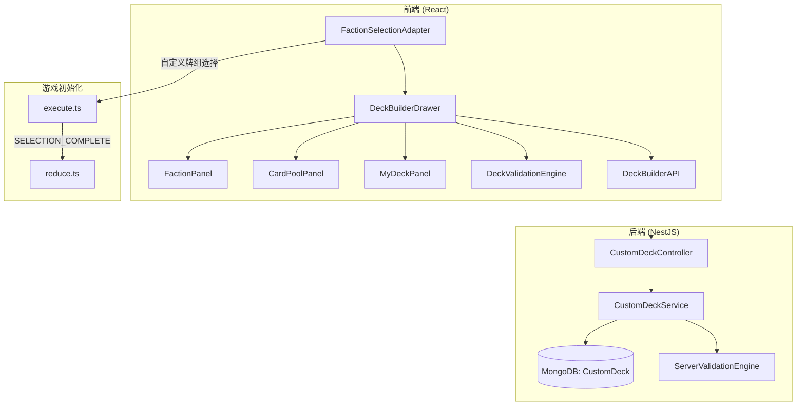

# Design Document: 召唤师战争自定义牌组 (SW Custom Deck)

## Overview

为召唤师战争添加自定义牌组构建功能。玩家可在阵营选择界面通过底部抽屉面板，跨阵营挑选卡牌构建自定义牌组，保存到 MongoDB，并在对局中使用。

核心设计决策：
- **前端验证 + 后端校验双重保障**：前端实时反馈验证状态，后端保存时再次校验防止篡改
- **复用现有卡牌数据**：自定义牌组引用 `config/factions/` 中已有的卡牌定义，不新增卡牌数据
- **NestJS 模块化**：后端新增 `custom-deck` 模块，遵循项目现有 NestJS 模式
- **序列化采用引用式**：存储卡牌 ID + 数量，而非完整卡牌对象，减少存储体积并保证数据一致性

## Architecture



### 数据流

1. **构建流程**：用户在 DeckBuilderDrawer 中选择召唤师 → 浏览卡牌池 → 添加/移除卡牌 → 前端实时验证 → 保存到后端
2. **使用流程**：用户在 FactionSelectionAdapter 选择已保存的自定义牌组 → 确认选择 → execute 层根据牌组数据生成 `shuffledDecks` → reduce 层初始化棋盘

## Components and Interfaces

### 1. 前端组件

#### DeckBuilderDrawer（抽屉主容器）
- 位置：`src/games/summonerwars/ui/DeckBuilderDrawer.tsx`
- 职责：管理抽屉开关状态、三栏布局、牌组编辑状态
- 使用 framer-motion 实现底部滑入/滑出动画
- 内部状态：当前编辑的牌组、选中的阵营、验证结果

#### FactionPanel（阵营列表）
- 位置：`src/games/summonerwars/ui/deckbuilder/FactionPanel.tsx`
- 职责：展示所有可用阵营，点击切换 CardPoolPanel 内容

#### CardPoolPanel（卡牌池）
- 位置：`src/games/summonerwars/ui/deckbuilder/CardPoolPanel.tsx`
- 职责：展示选中阵营的所有卡牌，按类型分组（召唤师/冠军/普通/事件）
- 不满足符号匹配的卡牌灰显
- 点击卡牌触发添加逻辑

#### MyDeckPanel（我的牌组）
- 位置：`src/games/summonerwars/ui/deckbuilder/MyDeckPanel.tsx`
- 职责：展示已选卡牌及数量、验证状态摘要、保存/加载/删除操作
- 自动填充的卡牌（起始单位、史诗事件、城门）标记为不可移除

#### useDeckBuilder Hook
- 位置：`src/games/summonerwars/ui/deckbuilder/useDeckBuilder.ts`
- 职责：封装牌组编辑的核心状态逻辑

```typescript
interface UseDeckBuilderReturn {
  // 状态
  currentDeck: DeckDraft;
  selectedFactionId: FactionId | null;
  validationResult: DeckValidationResult;
  savedDecks: SavedDeckSummary[];
  isLoading: boolean;

  // 召唤师操作
  selectSummoner: (summonerCard: UnitCard) => void;

  // 卡牌操作
  addCard: (card: Card) => AddCardResult;
  removeCard: (cardId: string) => void;

  // 阵营浏览
  selectFaction: (factionId: FactionId) => void;

  // 持久化
  saveDeck: (name: string) => Promise<void>;
  loadDeck: (deckId: string) => Promise<void>;
  deleteDeck: (deckId: string) => Promise<void>;

  // 牌组选择（用于对局）
  confirmDeck: (deckId: string) => void;
}
```

### 2. 验证引擎

#### DeckValidationEngine（前端 + 后端共享逻辑）
- 位置：`src/games/summonerwars/config/deckValidation.ts`
- 纯函数，不依赖 React，可在前端和后端复用

```typescript
interface DeckValidationResult {
  valid: boolean;
  errors: DeckValidationError[];
}

interface DeckValidationError {
  rule: DeckValidationRule;
  message: string;
  current: number;
  expected: number;
}

type DeckValidationRule =
  | 'summoner_count'
  | 'gate_10hp_count'
  | 'gate_5hp_count'
  | 'starting_units'
  | 'epic_events'
  | 'standard_events'
  | 'champions'
  | 'commons'
  | 'symbol_mismatch';

function validateDeck(deck: DeckDraft): DeckValidationResult;
function canAddCard(deck: DeckDraft, card: Card): { allowed: boolean; reason?: string };
function getSymbolMatch(card: Card, summonerSymbols: string[]): boolean;
```

### 3. 后端模块

#### CustomDeckModule
- 位置：`apps/api/src/modules/custom-deck/`
- 结构：controller + service + schema + DTOs
- 路由前缀：`/auth/custom-decks`（需要 JWT 认证）

#### API 端点

| 方法 | 路径 | 说明 |
|------|------|------|
| GET | `/auth/custom-decks` | 获取当前用户的牌组列表 |
| GET | `/auth/custom-decks/:id` | 获取单个牌组详情 |
| POST | `/auth/custom-decks` | 创建新牌组 |
| PUT | `/auth/custom-decks/:id` | 更新牌组 |
| DELETE | `/auth/custom-decks/:id` | 删除牌组 |

### 4. 游戏初始化集成

在 `execute.ts` 的 `HOST_START_GAME` 处理中，当检测到玩家使用自定义牌组时，不调用 `createDeckByFactionId`，而是根据自定义牌组数据构建牌组对象。

需要扩展 `SELECT_FACTION` 命令或新增 `SELECT_CUSTOM_DECK` 命令，payload 携带自定义牌组数据。

设计决策：**新增 `SELECT_CUSTOM_DECK` 命令**，与 `SELECT_FACTION` 并列，避免修改现有命令的 payload 结构。

```typescript
// 新增命令
SW_COMMANDS.SELECT_CUSTOM_DECK = 'sw:select_custom_deck';

// payload 结构
interface SelectCustomDeckPayload {
  deckData: SerializedCustomDeck;
}
```

## Data Models

### 前端类型

```typescript
/** 牌组草稿（编辑中） */
interface DeckDraft {
  name: string;
  summoner: UnitCard | null;
  /** 自动填充的卡牌（起始单位、史诗事件、城门） */
  autoCards: Card[];
  /** 用户手动添加的卡牌（cardId → 数量） */
  manualCards: Map<string, { card: Card; count: number }>;
}

/** 已保存牌组摘要（列表展示用） */
interface SavedDeckSummary {
  id: string;
  name: string;
  summonerName: string;
  summonerFaction: string;
  cardCount: number;
  updatedAt: string;
}
```

### 序列化格式（API 传输 & 数据库存储）

```typescript
/** 序列化的自定义牌组（存储/传输用） */
interface SerializedCustomDeck {
  name: string;
  summonerId: string;           // 召唤师卡牌 ID（如 'necro-summoner'）
  summonerFaction: FactionId;   // 召唤师所属阵营
  /** 手动选择的卡牌列表 */
  cards: SerializedCardEntry[];
}

interface SerializedCardEntry {
  cardId: string;       // 卡牌基础 ID（如 'necro-undead-warrior'）
  faction: FactionId;   // 卡牌所属阵营
  count: number;        // 数量
}
```

### MongoDB Schema

```typescript
@Schema({ timestamps: true })
class CustomDeck {
  @Prop({ type: String, required: true, index: true })
  ownerId: string;          // 用户 ID

  @Prop({ type: String, required: true, trim: true })
  name: string;             // 牌组名称

  @Prop({ type: String, required: true })
  summonerId: string;       // 召唤师 ID

  @Prop({ type: String, required: true })
  summonerFaction: string;  // 召唤师阵营

  @Prop({ type: [Object], required: true })
  cards: SerializedCardEntry[];  // 手动选择的卡牌

  createdAt: Date;
  updatedAt: Date;
}

// 索引：按用户查询 + 按更新时间排序
CustomDeckSchema.index({ ownerId: 1, updatedAt: -1 });
```

### 卡牌注册表（前端查找用）

为了从 `cardId` + `faction` 反序列化出完整卡牌对象，需要构建一个全局卡牌注册表：

```typescript
/** 卡牌注册表：cardId → Card */
type CardRegistry = Map<string, Card>;

function buildCardRegistry(): CardRegistry;
function lookupCard(registry: CardRegistry, cardId: string): Card | undefined;
```

注册表在应用启动时从 `config/factions/` 的所有阵营数据中构建，是只读的静态数据。

## Correctness Properties

*A property is a characteristic or behavior that should hold true across all valid executions of a system — essentially, a formal statement about what the system should do. Properties serve as the bridge between human-readable specifications and machine-verifiable correctness guarantees.*

### Property 1: 牌组验证完整性

*For any* DeckDraft 状态（包括合法和非法牌组），`validateDeck` 应正确识别所有违规项：召唤师数量恰好为1、十生命城门恰好1个、五生命城门恰好3个、起始单位恰好2个、史诗事件恰好2个、标准事件恰好6张、冠军单位恰好3个、普通单位恰好16个、且每张卡牌至少有1个符号与召唤师匹配。合法牌组返回 `valid: true`，非法牌组返回对应的 `errors` 列表。

**Validates: Requirements 5.1, 5.2, 5.3, 5.4, 5.5, 5.6, 5.7, 5.8**

### Property 2: 召唤师选择自动填充

*For any* 召唤师卡牌，选择该召唤师后，牌组的 `autoCards` 应包含：该召唤师的2个起始单位、2个史诗事件、1个十生命城门和3个五生命城门。更换召唤师时，旧召唤师的自动卡牌应被完全替换为新召唤师的自动卡牌。

**Validates: Requirements 3.1, 3.2, 3.3, 3.4**

### Property 3: 符号匹配正确性

*For any* 卡牌和召唤师组合，`getSymbolMatch(card, summonerSymbols)` 返回 `true` 当且仅当该卡牌的 `deckSymbols` 与召唤师的 `deckSymbols` 存在至少一个交集。不满足符号匹配的卡牌不可被添加到牌组。

**Validates: Requirements 3.5, 4.2**

### Property 4: 卡牌数量上限约束

*For any* 牌组状态和待添加卡牌，`canAddCard` 应在以下情况返回 `false`：同名标准事件已有2张、同名冠军已有1张、同名普通单位已有4张。在未达上限时应返回 `true`（前提是符号匹配通过）。

**Validates: Requirements 4.4, 4.5, 4.6**

### Property 5: 添加/移除卡牌往返一致性

*For any* 合法的牌组状态和可添加的卡牌，先执行 `addCard` 再执行 `removeCard` 应使牌组恢复到添加前的状态（manualCards 的内容和数量一致）。

**Validates: Requirements 4.1, 4.3**

### Property 6: 序列化往返一致性

*For any* 合法的 Custom_Deck 对象，执行 `serialize(deck)` 后再执行 `deserialize(json)` 应产生与原始对象等价的 Custom_Deck（召唤师、卡牌列表及数量完全一致）。

**Validates: Requirements 8.1, 8.2, 8.3**

### Property 7: 自定义牌组生成游戏牌组结构等价性

*For any* 合法的自定义牌组，由 `buildGameDeckFromCustom(customDeck)` 生成的牌组对象应与 `createDeckByFactionId` 生成的预构筑牌组具有相同的结构：包含 summoner、summonerPosition、startingUnits、startingGate、startingGatePosition 和 deck 数组，且所有卡牌对象的类型字段完整。

**Validates: Requirements 7.3**

### Property 8: 阵营卡牌池完整性

*For any* 阵营 ID，`getCardPoolByFaction(factionId)` 返回的卡牌列表应包含该阵营的所有卡牌（召唤师、冠军、普通单位、事件），且按类型正确分组。

**Validates: Requirements 2.2**

## Error Handling

| 场景 | 处理方式 |
|------|----------|
| 后端 API 请求失败（网络错误/5xx） | 前端显示 Toast 错误提示，保留当前编辑状态不丢失 |
| 后端验证失败（牌组不合法） | 返回 400 + 具体错误列表，前端显示验证错误 |
| 牌组名称重复 | 后端返回 409，前端提示用户修改名称 |
| 卡牌注册表中找不到 cardId | 反序列化时跳过该卡牌并记录警告，不阻塞加载 |
| JWT 过期 | 401 响应触发前端重新登录流程（已有机制） |
| 牌组数量超过上限（每用户最多20个） | 后端返回 400，前端提示删除旧牌组 |

## Testing Strategy

### 属性测试（Property-Based Testing）

使用 **fast-check** 库进行属性测试，每个属性至少运行 100 次迭代。

测试文件：`src/games/summonerwars/__tests__/deck-validation.property.test.ts`

需要构建的生成器（Arbitraries）：
- `arbDeckDraft`：生成随机的 DeckDraft（包括合法和非法状态）
- `arbValidDeckDraft`：生成满足所有验证规则的合法 DeckDraft
- `arbSummonerCard`：从所有阵营的召唤师中随机选择
- `arbCard`：从所有阵营的卡牌中随机选择
- `arbSerializedCustomDeck`：生成随机的序列化牌组数据

每个属性测试必须以注释标注对应的设计属性编号：
```typescript
// Feature: sw-custom-deck, Property 1: 牌组验证完整性
```

### 单元测试

测试文件：`src/games/summonerwars/__tests__/deck-builder.test.ts`

覆盖场景：
- 卡牌注册表构建正确性
- 特定阵营的符号匹配边界情况（如双斧通用符号）
- 空牌组验证
- 已满牌组验证
- API 错误处理（mock fetch）

### 后端测试

测试文件：`apps/api/src/modules/custom-deck/__tests__/custom-deck.service.test.ts`

覆盖场景：
- CRUD 操作正确性
- 权限校验（只能操作自己的牌组）
- 牌组数量上限
- 输入验证（DTO 校验）
