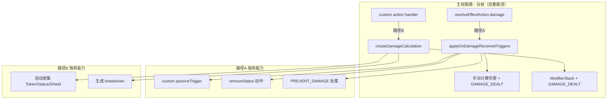
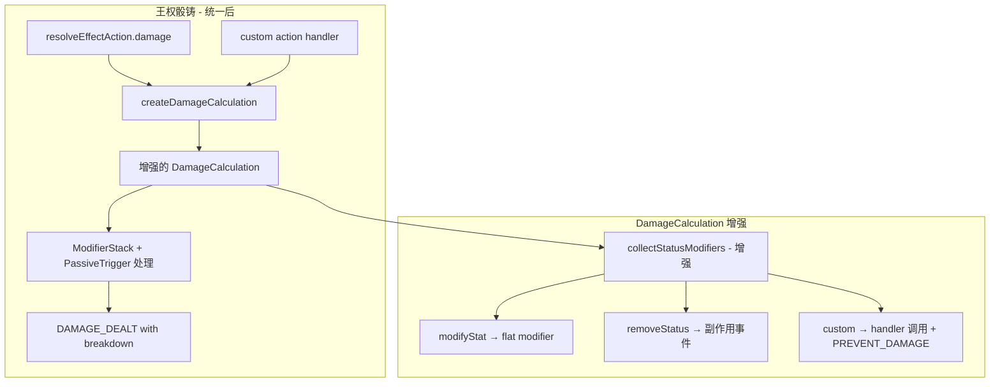

# 设计文档：统一伤害/Buff 系统

## 概述

本设计分三个优先级层次统一三个游戏的伤害计算与 buff 日志系统：

1. **高优先级**：修复王权骰铸的双重伤害路径，将 `resolveEffectAction.damage` 迁移到 `createDamageCalculation`，并增强 DamageCalculation 以支持 PassiveTrigger 的 `custom`/`removeStatus` 动作类型
2. **中优先级**：为召唤师战争的攻击日志添加战力 breakdown tooltip
3. **低优先级**：为大杀四方的基地结算日志添加力量 breakdown

核心原则：**只修 bug + 只增强日志展示，不改变任何现有正确的游戏逻辑**。

## 架构

### 当前架构问题



### 目标架构



## 组件与接口

### 1. DamageCalculation 增强（引擎层）

**文件**: `src/engine/primitives/damageCalculation.ts`

**变更**: 增强 `collectStatusModifiers()` 以支持 PassiveTrigger 的全部动作类型。

```typescript
// 新增：DamageResult 扩展，支持副作用事件
interface DamageResult {
  // ... 现有字段
  /** 副作用事件（removeStatus、custom handler 产生的事件） */
  sideEffectEvents: GameEvent[];
}

// 新增：PassiveTrigger handler 注入接口
interface PassiveTriggerHandler {
  /** 处理 custom 类型的 passiveTrigger 动作 */
  handleCustomAction(
    actionId: string,
    context: {
      targetId: string;
      attackerId: string;
      sourceAbilityId?: string;
      state: any;
      timestamp: number;
      random?: any;
      damageAmount: number;
      tokenId: string;
      tokenStacks: number;
    }
  ): { events: GameEvent[]; preventAmount: number };
}

// DamageCalculationConfig 扩展
interface DamageCalculationConfig {
  // ... 现有字段
  /** PassiveTrigger handler（游戏层注入） */
  passiveTriggerHandler?: PassiveTriggerHandler;
}
```

**设计决策**：PassiveTrigger 的 `custom` 动作处理通过 `PassiveTriggerHandler` 接口注入，而非在引擎层直接依赖游戏层的 `getCustomActionHandler`。这保持了引擎层与游戏层的解耦。

### 2. resolveEffectAction.damage 迁移（王权骰铸）

**文件**: `src/games/dicethrone/domain/effects.ts`

**变更**: 将 `resolveEffectAction` 的 `damage` case 从手动计算迁移到 `createDamageCalculation`。

```typescript
// 迁移前（路径A）
case 'damage': {
    let totalValue = (action.value ?? 0) + (bonusDamage ?? 0);
    const passiveResult = applyOnDamageReceivedTriggers(ctx, dmgTargetId, totalValue, ...);
    totalValue = passiveResult.damage;
    // ... 手动构建 DAMAGE_DEALT
}

// 迁移后（统一路径）
case 'damage': {
    const baseDamage = (action.value ?? 0) + (bonusDamage ?? 0);
    if (baseDamage <= 0) continue;
    
    const calc = createDamageCalculation({
        baseDamage,
        source: { playerId: attackerId, abilityId: sourceAbilityId },
        target: { playerId: dmgTargetId },
        state,
        autoCollectTokens: true,
        autoCollectStatus: true,
        autoCollectShields: true,
        passiveTriggerHandler: createDTPassiveTriggerHandler(ctx, random),
        timestamp,
    });
    const result = calc.resolve();
    events.push(...result.sideEffectEvents);
    
    // Token 响应窗口逻辑保持不变
    if (result.finalDamage > 0) {
        // ... shouldOpenTokenResponse 检查（与现有逻辑一致）
    }
}
```

### 3. Pyromancer 修复

**文件**: `src/games/dicethrone/domain/customActions/pyromancer.ts`

**变更**: 移除所有 `autoCollectStatus: false, autoCollectTokens: false, autoCollectShields: false`，使用默认值 `true`。

对于确实需要跳过自动收集的场景（如 paladin 自伤不触发护盾），保留 `autoCollectShields: false` 并添加注释说明原因。

### 4. 召唤师战争战力 Breakdown

**文件**: `src/games/summonerwars/domain/abilityResolver.ts`, `src/games/summonerwars/actionLog.ts`

**变更**: 
- `calculateEffectiveStrength` 返回 breakdown 明细（而非仅返回最终值）
- ActionLog 使用 `buildDamageBreakdownSegment` 渲染战力 tooltip

```typescript
// 新增：战力计算结果（含 breakdown）
interface StrengthResult {
  baseStrength: number;
  finalStrength: number;
  modifiers: Array<{
    source: string;      // buff 来源 ID
    sourceName: string;  // buff 显示名称
    value: number;       // 贡献值
  }>;
}

// calculateEffectiveStrength 改为返回 StrengthResult
function calculateEffectiveStrength(
  unit: UnitInstance,
  state: SummonerWarsCore,
  targetUnit?: UnitInstance
): StrengthResult {
  // ... 现有逻辑，但每个 buff 记录到 modifiers 数组
}

// 向后兼容：保留返回 number 的便捷函数
function getEffectiveStrengthValue(
  unit: UnitInstance,
  state: SummonerWarsCore,
  targetUnit?: UnitInstance
): number {
  return calculateEffectiveStrength(unit, state, targetUnit).finalStrength;
}
```

### 5. 大杀四方力量 Breakdown

**文件**: `src/games/smashup/domain/ongoingModifiers.ts`, `src/games/smashup/actionLog.ts`

**变更**:
- 新增 `getOngoingPowerModifierDetails` 返回每个修正来源的明细
- ActionLog 在基地结算时使用 breakdown 格式

```typescript
// 新增：力量修正明细
interface PowerModifierDetail {
  sourceDefId: string;   // 来源随从/卡牌 defId
  sourceName: string;    // 显示名称
  value: number;         // 修正值
}

// 新增函数（不修改现有 getOngoingPowerModifier）
function getOngoingPowerModifierDetails(
  state: SmashUpCore,
  minion: MinionOnBase,
  baseIndex: number
): PowerModifierDetail[] {
  // 遍历注册表，收集每个非零修正的来源信息
}

// 新增：完整力量 breakdown
function getEffectivePowerBreakdown(
  state: SmashUpCore,
  minion: MinionOnBase,
  baseIndex: number
): {
  basePower: number;
  permanentModifier: number;  // powerModifier
  tempModifier: number;       // tempPowerModifier
  ongoingDetails: PowerModifierDetail[];
  finalPower: number;
} {
  // 组合所有修正来源
}
```

### 6. buildDamageBreakdownSegment 通用化（引擎层）

**文件**: `src/engine/primitives/actionLogHelpers.ts`

**变更**: 支持自定义基础值标签。

```typescript
// buildDamageBreakdownSegment 新增可选参数
function buildDamageBreakdownSegment(
  damage: number,
  payload: DamageLogPayload,
  resolver: DamageSourceResolver,
  fallbackNs?: string,
  options?: {
    /** 自定义基础值标签（默认 'actionLog.damageSource.original'） */
    baseLabel?: string;
    baseLabelIsI18n?: boolean;
    baseLabelNs?: string;
  }
): ActionLogSegment;
```

## 数据模型

### DamageResult 扩展

```typescript
interface DamageResult {
  baseDamage: number;
  modifiers: Array<{
    type: string;
    value: number;
    sourceId: string;
    sourceName?: string;
  }>;
  finalDamage: number;
  actualDamage: number;
  breakdown: DamageBreakdown;
  /** 新增：副作用事件（PassiveTrigger 的 removeStatus/custom 产生） */
  sideEffectEvents: GameEvent[];
}
```

### PassiveTriggerHandler 接口

```typescript
interface PassiveTriggerHandler {
  handleCustomAction(
    actionId: string,
    context: {
      targetId: string;
      attackerId: string;
      sourceAbilityId?: string;
      state: any;
      timestamp: number;
      random?: any;
      damageAmount: number;
      tokenId: string;
      tokenStacks: number;
    }
  ): { events: GameEvent[]; preventAmount: number };
}
```

### StrengthResult（召唤师战争）

```typescript
interface StrengthResult {
  baseStrength: number;
  finalStrength: number;
  modifiers: Array<{
    source: string;
    sourceName: string;
    value: number;
  }>;
}
```

### PowerModifierDetail（大杀四方）

```typescript
interface PowerModifierDetail {
  sourceDefId: string;
  sourceName: string;
  value: number;
}
```


## 正确性属性

*正确性属性是系统在所有有效执行中都应保持为真的特征或行为——本质上是关于系统应该做什么的形式化陈述。属性是人类可读规范与机器可验证正确性保证之间的桥梁。*

### Property 1: 伤害路径统一回归一致性

*For any* 王权骰铸伤害场景（任意攻击者、防御者、基础伤害值、状态效果组合），统一后的伤害路径通过 `createDamageCalculation` 计算的最终伤害值 SHALL 与统一前 `applyOnDamageReceivedTriggers` 路径的计算结果一致（Pyromancer bug 修复场景除外）。

**Validates: Requirements 1.1, 1.6**

### Property 2: PassiveTrigger custom/PREVENT_DAMAGE 处理

*For any* 带有 `custom` 类型 PassiveTrigger（产生 PREVENT_DAMAGE 事件）的 TokenDef 和任意基础伤害值，DamageCalculation 的 `resolve()` 返回的 `finalDamage` SHALL 等于 `baseDamage - preventAmount`（下限为 0），且 `sideEffectEvents` 包含 handler 产生的所有副作用事件。

**Validates: Requirements 1.2, 3.4, 3.5**

### Property 3: PassiveTrigger removeStatus 处理

*For any* 带有 `removeStatus` 类型 PassiveTrigger 的 TokenDef 和任意基础伤害值，DamageCalculation 的 `resolve()` 返回的 `sideEffectEvents` SHALL 包含对应的 STATUS_REMOVED 事件，且事件的 statusId 和 stacks 与 PassiveTrigger 配置一致。

**Validates: Requirements 1.3, 3.3**

### Property 4: Pyromancer 伤害正确应用所有修正

*For any* Pyromancer custom action 产生的伤害和任意目标状态（含 Token、Status、Shield），DamageCalculation SHALL 正确收集并应用所有三种类型的修正，最终伤害值反映所有修正的累积效果。

**Validates: Requirements 2.1, 2.2, 2.3**

### Property 5: Token 响应窗口行为保持

*For any* 伤害事件，当目标拥有可用的响应 Token 时，统一后的路径 SHALL 生成 TOKEN_RESPONSE_REQUESTED 事件替代 DAMAGE_DEALT 事件，与统一前行为一致。

**Validates: Requirements 1.5**

### Property 6: 召唤师战争战力 Breakdown 完整性

*For any* 拥有战力 buff 的单位，`calculateEffectiveStrength` 返回的 `StrengthResult.modifiers` 数组 SHALL 包含所有非零 buff 的来源名称和贡献值，且 `baseStrength + sum(modifiers.value)` 等于 `finalStrength`。

**Validates: Requirements 4.1, 4.2**

### Property 7: 召唤师战争 DamageSourceResolver 完整性

*For any* 已注册的能力 ID 或已知的 reason 字符串，召唤师战争的 `DamageSourceResolver.resolve()` SHALL 返回非 null 的 `SourceLabel`。

**Validates: Requirements 4.4**

### Property 8: 召唤师战争日志向后兼容

*For any* 无战力 buff 的攻击场景，ActionLog 的输出 SHALL 与增强前的格式完全一致（不包含 breakdown segment）。

**Validates: Requirements 4.5**

### Property 9: 大杀四方力量明细总和一致性

*For any* 随从和基地状态，`getOngoingPowerModifierDetails` 返回的明细值总和 SHALL 等于 `getOngoingPowerModifier` 返回的总值，且 `getEffectivePower` 的返回值与增强前一致。

**Validates: Requirements 5.4, 5.5**

### Property 10: 大杀四方力量 Breakdown 完整性

*For any* 拥有力量修正的随从，`getEffectivePowerBreakdown` 返回的 breakdown SHALL 包含所有非零修正来源，且 `basePower + permanentModifier + tempModifier + sum(ongoingDetails.value)` 等于 `finalPower`。

**Validates: Requirements 5.1, 5.2**

## 错误处理

### DamageCalculation PassiveTrigger 处理

- **custom handler 未注册**: 记录 warning 日志，跳过该 PassiveTrigger 动作，不影响伤害计算
- **custom handler 抛出异常**: 捕获异常，记录 error 日志，跳过该动作，伤害计算继续
- **passiveTriggerHandler 未注入**: 跳过所有 `custom` 类型动作，仅处理 `modifyStat` 和 `removeStatus`（向后兼容）

### 召唤师战争 Breakdown

- **buff 来源无法解析**: DamageSourceResolver 返回 null，使用 sourceId 作为 fallback 显示文本
- **calculateEffectiveStrength 返回负值**: 保持现有 `Math.max(0, strength)` 行为，breakdown 中仍显示原始修正值

### 大杀四方 Breakdown

- **modifier 注册表为空**: `getOngoingPowerModifierDetails` 返回空数组，ActionLog 显示普通数值
- **modifier 函数抛出异常**: 捕获异常，跳过该 modifier，记录 warning

## 测试策略

### 属性测试（Property-Based Testing）

使用 `fast-check` 库，每个属性测试运行至少 100 次迭代。

**生成器设计**:
- 王权骰铸状态生成器：随机生成玩家状态（HP、Token、Status、Shield）、TokenDef（含各类 PassiveTrigger）、基础伤害值
- 召唤师战争单位生成器：随机生成单位（含各种 buff 组合：附加事件卡、能力、充能等）
- 大杀四方随从生成器：随机生成随从（含 powerModifier、tempPowerModifier）和基地（含 ongoingActions）

**属性测试标注格式**: `Feature: unified-damage-buff-system, Property {N}: {property_text}`

### 单元测试

- **DamageCalculation 增强**: 测试 removeStatus、custom/PREVENT_DAMAGE 的具体场景
- **Pyromancer 修复**: 测试每个 custom action 在有状态效果时的伤害计算
- **召唤师战争 Breakdown**: 测试各种 buff 组合的 breakdown 输出
- **大杀四方 Breakdown**: 测试各种 ongoing modifier 组合的 breakdown 输出
- **边界条件**: 无 buff 时不显示 breakdown、伤害为 0 时的处理、负值修正使伤害降为 0

### 回归测试

- 王权骰铸现有角色测试（monk、shadow_thief、barbarian、moon_elf、paladin）应全部通过
- 召唤师战争现有攻击测试应全部通过
- 大杀四方现有基地结算测试应全部通过
