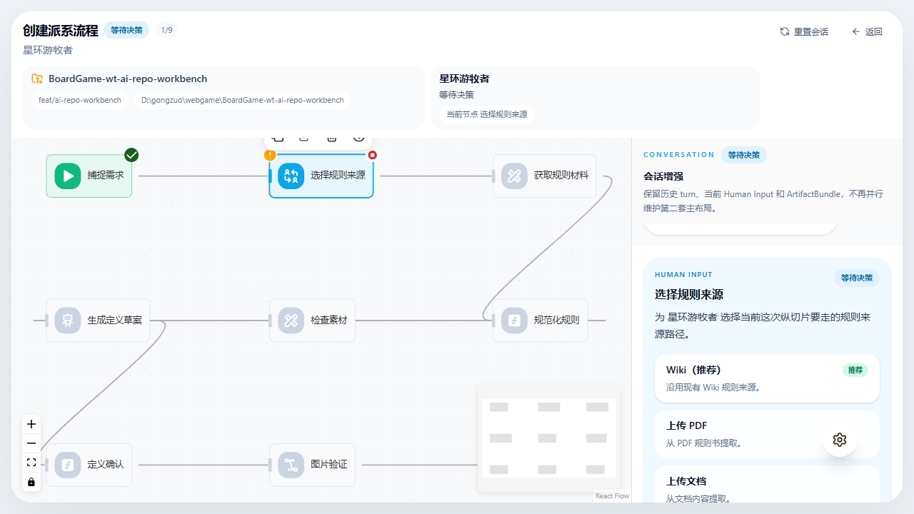
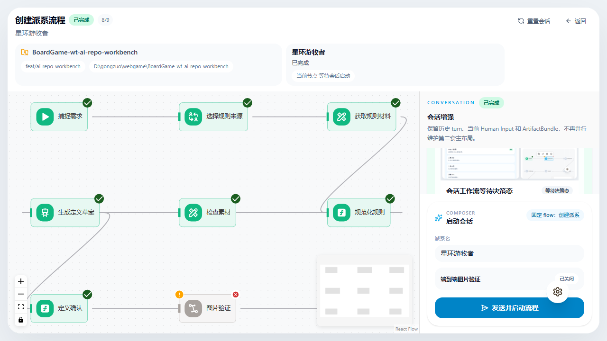

# AI 仓库工作台 E2E 证据

> 说明：本文件保留的是 `/dev/ai-repo-workbench` 旧入口在下线前的最后一轮页面证据。
> 当前正式入口已改为 Flowise 官方聊天页，主验收文档改看 `evidence/smashup/flowise-ai-repo-workbench-sidebar-e2e.md`。
> 首页工具入口下线后的当前回归，改由 `e2e/_shared/lobby.e2e.ts` 中“AI 仓库工作台已从首页工具入口下线，避免继续走旧主壳”这条用例覆盖。

## 2026-04-09 首页工具入口下线回归

### 执行命令

```powershell
npm run test:e2e:ci:file -- e2e/_shared/lobby.e2e.ts "AI 仓库工作台已从首页工具入口下线，避免继续走旧主壳"
```

### 截图路径

- `D:\gongzuo\webgame\BoardGame-wt-ai-repo-workbench\test-results\evidence-screenshots\_shared\lobby.e2e\AI-仓库工作台已从首页工具入口下线，避免继续走旧主壳\ai-repo-workbench-home-entry-retired.png`

### 人工观察

- 当前首页切到 `工具` 分类后，只剩 `架构可视化 / 素材切片机 / 音效浏览器 / 特效预览 / UGC 原型制作器` 五张卡片，`AI 仓库工作台` 已经完全不在首页工具入口里。
- 截图里工具分类按钮仍处于选中态，说明这不是因为分类切错，而是首页主入口确实已经收掉旧 workbench 壳。
- 页面底部也没有出现任何跳转到 `/dev/ai-repo-workbench` 的悬浮入口或补丁按钮，达到“避免用户继续走旧主壳”的验收标准。

## 目标

验证 `AI 仓库工作台` 已经回到“以 Flowise/Agentflow 自身壳为主，只在 header 与 palette 做必要扩展”的页面：

- 主体仍是 `Flowise` 节点图主视图，而不是外层再套一套平行页面壳
- 会话增强、`Human Input`、composer 都挂在 `Agentflow` palette 上
- 顶部信息回到紧凑 header，不再堆两层大卡片挤压节点图
- 完成后历史会话里仍保留 `ArtifactBundle` 与截图结果

## 执行命令

```powershell
npm run typecheck
$env:BG_HEAVY_MEMORY_MIN_FREE_GB='0.5'
npm run test:e2e:ci:file -- lobby.e2e.ts "AI 仓库工作台可从工具入口进入并完成 new-faction 纵切片"
```

结果：

- `npm run typecheck`：通过
- `AI 仓库工作台可从工具入口进入并完成 new-faction 纵切片`：`1 passed`
- 备注：本机当时可用内存不足默认门禁阈值，E2E 使用单次命令级 `BG_HEAVY_MEMORY_MIN_FREE_GB=0.5` 放宽启动条件；未修改仓库默认脚本

## 截图路径

- 等待决策态原始截图：
  `D:\gongzuo\webgame\BoardGame-wt-ai-repo-workbench\test-results\evidence-screenshots\_shared\lobby.e2e\AI-仓库工作台可从工具入口进入并完成-new-faction-纵切片\ai-repo-workbench-node-graph-waiting-decision.png`
- 完成态原始截图：
  `D:\gongzuo\webgame\BoardGame-wt-ai-repo-workbench\test-results\evidence-screenshots\_shared\lobby.e2e\AI-仓库工作台可从工具入口进入并完成-new-faction-纵切片\ai-repo-workbench-node-graph-complete.png`
- 等待决策态固化副本：
  `D:\gongzuo\webgame\BoardGame-wt-ai-repo-workbench\evidence\_shared\assets\ai-repo-workbench-e2e\node-graph-waiting-decision.png`
- 完成态固化副本：
  `D:\gongzuo\webgame\BoardGame-wt-ai-repo-workbench\evidence\_shared\assets\ai-repo-workbench-e2e\node-graph-complete.png`

## 截图 1：等待决策态



人工观察：

- 节点图重新占据页面主面积，`选择规则来源` 作为当前停留节点保持蓝色选中边框，说明主视图已经回到 workflow 本身。
- 顶部只保留紧凑 header 信息：标题、状态 badge、仓库/worktree/当前节点摘要和操作按钮，没有再堆叠独立大面板压缩画布高度。
- 右侧 palette 顶部只剩一个最小 `会话` 标题和当前派系名，没有再出现“会话增强”“固定 flow”这类解释性文案；`Human Input` 卡直接作为当前需要处理的内容出现。
- 当前 `Wiki（推荐）`、`上传 PDF`、`上传文档`、`其他 URL` 四个选项完整可见，说明必要的人审链路仍然挂在 Flowise 壳内，而不是外面另起一套布局。

## 截图 2：完成态



人工观察：

- 顶部标题右侧显示 `已完成`，主链路节点转为绿色完成态，说明从启动到产物发布的执行链已完整跑通。
- 右侧 palette 首屏先显示会话产物卡，再显示缩到最小的 `启动会话` composer；composer 只保留 `派系名`、`图片验证` 和发送按钮，没有额外解释块。
- 节点图仍保持最大可视面积，说明这次重构没有再把会话区抬成主视图。
- `图片验证` 节点保持灰色 skipped，composer 中的开关仍显示“已关闭”，说明可选节点状态在工作流视图与会话输入配置之间保持一致。

## 覆盖链路

本次 E2E 覆盖的真实主链路：

`工具入口 -> 进入 AI 仓库工作台 -> 重置会话 -> 关闭图片验证 -> 输入派系名 -> 启动流程 -> 在 Human Input 选择 Wiki -> 继续执行 -> 返回 ArtifactBundle 与图片产物`

## 当前结论

- 浏览器端真实链路已经跑通：工具入口进入工作台、启动 `new-faction`、选择 Wiki、继续执行、最终完成
- 页面主交互已经收敛到 `Flowise 主壳 + 右侧会话 palette 增强`
- 当前 E2E 与截图都能证明：节点图重新回到主视图，同时 `Human Input` 仍保持首屏可见
- 当前实现已经具备真实的会话时间线语义，但仍然只覆盖 `new-faction` 这条固定 flow，尚未扩展到自动路由多个 workflow

## 残留说明

- 当前 `定义确认` 节点仍是自动通过占位，不再向用户暴露第二条审批链；这符合本轮“不要多余人审壳”的收口方向。
- `图片验证` 仍是可选节点；本次用例保持关闭，目的是验证“关闭后显式 skipped + 页面仍返回已有图片产物”这条链。
- 下一轮若继续扩展产品能力，优先项应转到：让主界面根据用户需求自动选择 workflow，并决定是否把 `codex exec` 正式接入节点执行器。
