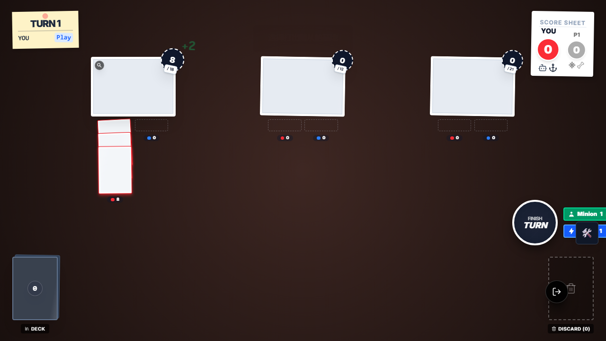
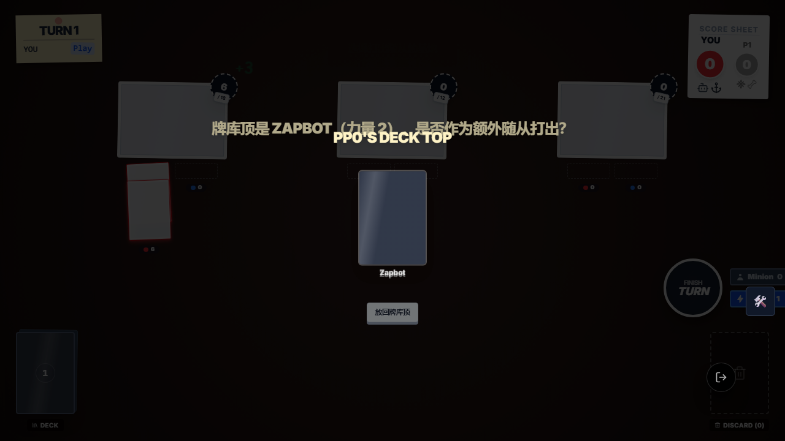
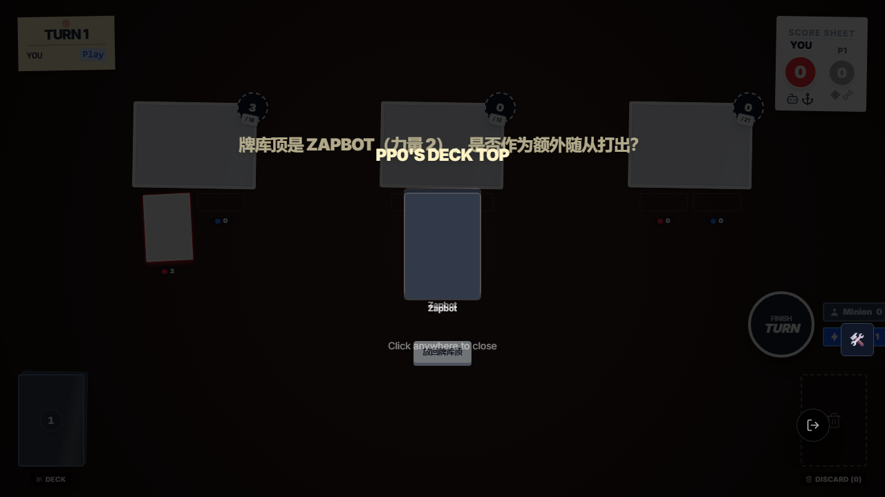
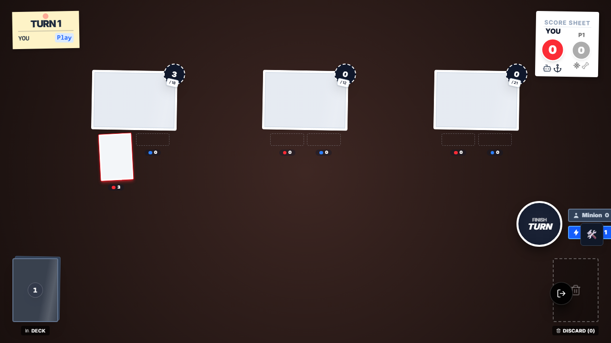
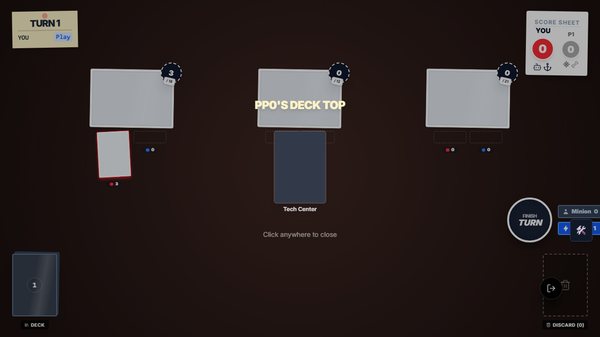

# 盘旋机器人链式交互 E2E 证据

## 本次目标

清理老旧 E2E 污染后，验证 `e2e/smashup-robot-hoverbot-chain.e2e.ts` 在当前新框架下可稳定运行，并覆盖盘旋机器人（`robot_hoverbot`）的 5 条关键链路：

1. 连续打出两个盘旋机器人
2. 第二个盘旋读取到新的牌库顶
3. 交互不会一闪而过
4. 可以选择跳过
5. 牌库顶是行动卡时不会错误创建交互

## 执行命令

- `node .\node_modules\typescript\bin\tsc --noEmit --pretty false`
- `npx playwright test --list`
- `npx playwright test e2e/smashup-robot-hoverbot-chain.e2e.ts --reporter=list`
- 为了稳定保留每张截图，又分别执行了 5 条单测级命令：
  - `npx playwright test e2e/smashup-robot-hoverbot-chain.e2e.ts --grep '连续打出两个盘旋机器人' --reporter=list`
  - `npx playwright test e2e/smashup-robot-hoverbot-chain.e2e.ts --grep '第二个盘旋应该看到新的牌库顶' --reporter=list`
  - `npx playwright test e2e/smashup-robot-hoverbot-chain.e2e.ts --grep '交互不应该一闪而过' --reporter=list`
  - `npx playwright test e2e/smashup-robot-hoverbot-chain.e2e.ts --grep '跳过' --reporter=list`
  - `npx playwright test e2e/smashup-robot-hoverbot-chain.e2e.ts --grep '行动卡' --reporter=list`

## 关键结论

- Playwright discovery 已恢复可用；旧 fixture / 旧 helper / 语法损坏文件不会再把整套 E2E discovery 炸掉。
- `GameTestContext.openTestGame()` 统一了当前仓库真实可用的测试入口。
- `GameTestContext` 在选择交互选项前会先关闭 RevealOverlay，解决了 Hoverbot 浮层遮挡真实交互的问题。
- `GameTestContext.setupScene()` 现在会从 Smash Up 权威卡牌表读取 `hand/deck/discard` 的真实 `type`，不再靠关键词猜牌型。
- 因此 `deck: ['robot_tech_center']` 会被正确识别为行动卡，`robot_hoverbot` 不会再被错误地当成“额外随从可打出”的交互来源。

## 截图审查

### 1. 连续打出两个盘旋机器人后最终场面

审查结论：

- 左侧第一个基地上能看到 3 张己方随从，其中包含 2 张盘旋机器人和 1 张 Zapbot。
- 右侧操作 HUD 仍显示 `Minion 1`，说明额外随从额度流程没有把正常阶段打崩。
- 这张图证明链式第二步没有卡死，且第二个盘旋最终成功把新的牌库顶随从打了出来。

### 2. 第二个盘旋读取到新的牌库顶

审查结论：

- 画面中央展示的是 `Zapbot`，不是第二张 `Hoverbot`。
- 文案明确处于“是否作为额外随从打出”的交互阶段，说明第二个盘旋的交互对象已经更新到新的牌库顶。
- 这张图直接验证了“旧 continuationContext / 旧牌库顶引用”没有污染第二次交互。

### 3. 交互不会一闪而过

审查结论：

- 画面仍停留在 `Zapbot` 的 Hoverbot 交互层，且底部还有 `Click anywhere to close` 提示。
- 说明 RevealOverlay 和真实交互在同屏时，测试仍能稳定观察到交互存在，而不会瞬间被清掉。
- 这张图验证了“交互可见性”与 E2E 等待逻辑已经对齐。

### 4. 选择跳过后的场面

审查结论：

- 棋盘上只剩首张盘旋机器人，没有额外随从落地。
- 左下牌库计数仍为 `1`，与测试断言“Zapbot 仍在牌库顶、未被打出”一致。
- 这张图证明 `skip` 分支会正确关闭交互且不会错误消耗/移动牌库顶卡牌。

### 5. 牌库顶是行动卡时不创建交互

审查结论：

- 画面中央展示的牌是 `Tech Center`，即行动卡。
- 屏幕上没有 Hoverbot 的“打出 / 跳过”选择按钮，只剩展示层本身。
- 这与最终断言 `state.sys.interaction?.current === undefined` 一致，证明 `setupScene` 现在不会把行动卡误造为随从。

## 根因与修复归纳

### 根因 1：老 E2E 文件污染 discovery

- 多个旧 `.e2e.ts` 仍依赖已经废弃的 fixture / helper，或者自身语法已经损坏。
- 这些文件会在 Playwright discovery 阶段直接报错，导致新框架测试也没法稳定执行。

### 根因 2：新框架缺少部分高频交互封装

- Hoverbot 场景真实链路是“打出首张随从 → RevealOverlay 展示牌库顶 → simple-choice → 选基地”。
- 老测试里把这条链路写成了过时的确认流，且没有处理 RevealOverlay 对交互点击的遮挡。

### 根因 3：`setupScene` 牌型推断不可靠

- 之前 `hand/deck/discard` 中的字符串卡牌只靠关键词推断 `type`。
- `robot_tech_center` 没命中关键词，被错误推成 `minion`，于是 Hoverbot 错误创建了额外交互。
- 现在已改为优先读取 `src/games/smashup/data/cards.ts` 中的权威卡牌定义，只在缺失定义时才走旧启发式兜底。

## 最终结果

- `e2e/smashup-robot-hoverbot-chain.e2e.ts`：5/5 通过
- Playwright discovery：恢复正常
- Hoverbot 关键链路：浏览器实跑通过，截图已人工审查
