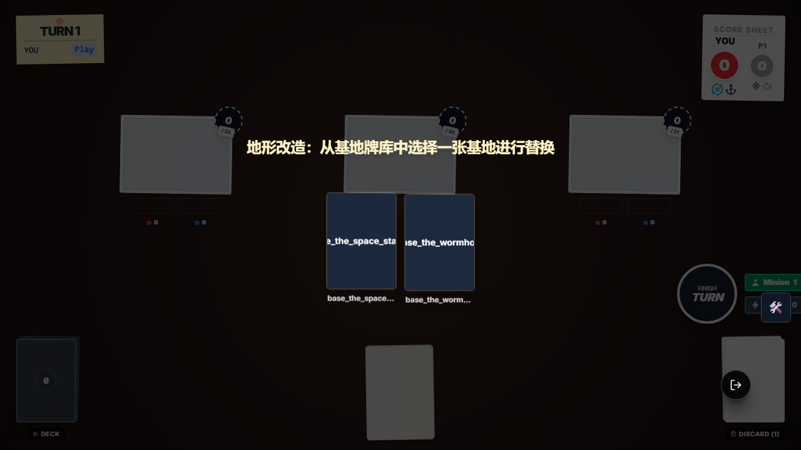
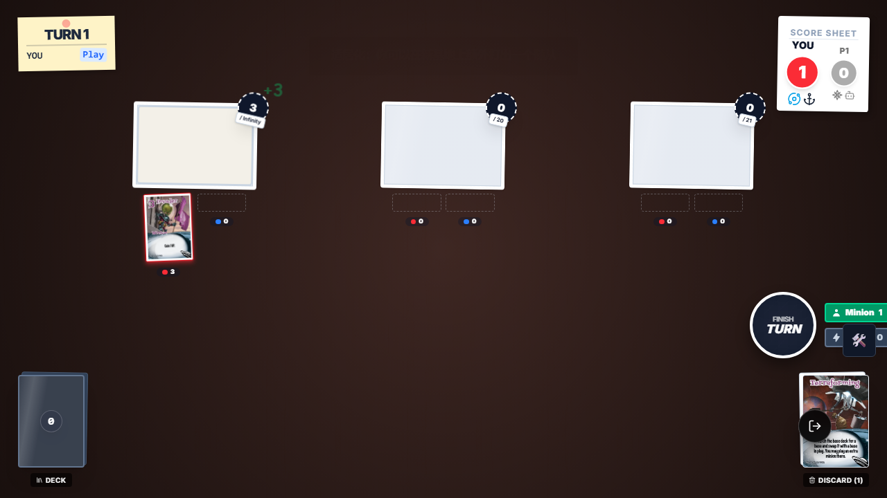
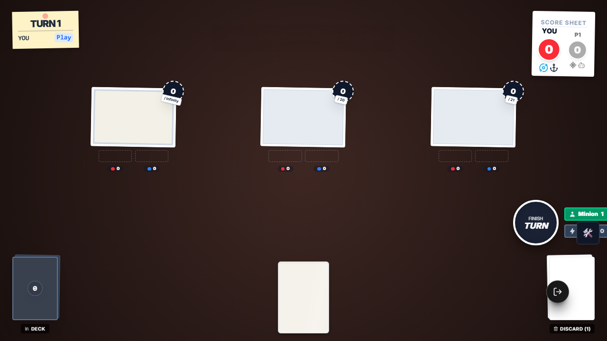
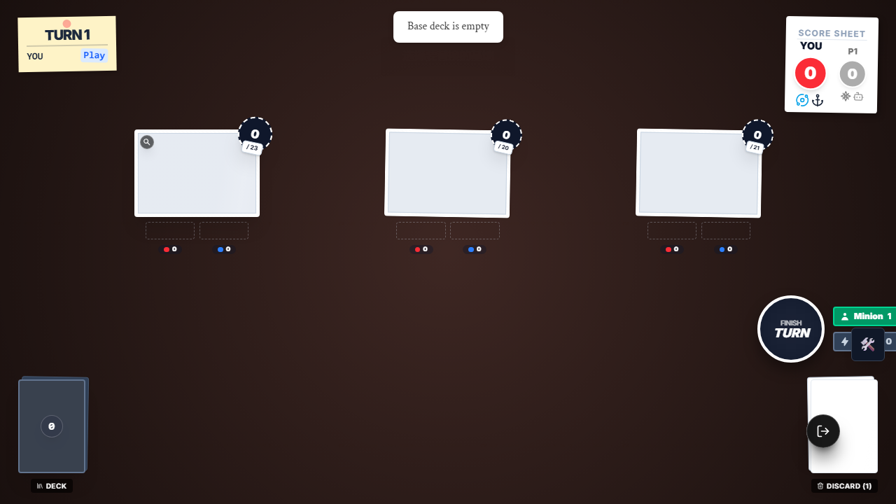

# SmashUp Alien Terraform E2E 证据

## 本次目标

将 `e2e/smashup-alien-terraform.e2e.ts` 从旧的 `setupOnlineMatch + debug panel` 写法迁移到当前新框架，并验证 `alien_terraform` 的 3 条真实链路：

1. 选旧基地 → 选新基地 → 在新基地额外打出随从
2. 跳过额外随从打出
3. 基地牌堆为空时优雅失败

## 执行命令

- `node .\node_modules\typescript\bin\tsc --noEmit --pretty false`
- `npx playwright test e2e/smashup-alien-terraform.e2e.ts --reporter=list`
  - 本轮为了复用已起开发服，实际使用了 `PW_USE_DEV_SERVERS=true`

## 关键结论

- 该文件已迁移为 `import { test, expect } from './framework'`，不再依赖失效的旧 helper。
- 交互选择不再靠中文文案和 `text=` 选择器，而是直接对齐 `sourceId`：
  - `alien_terraform`
  - `alien_terraform_choose_replacement`
  - `alien_terraform_play_minion`
- `GameTestContext.selectOption()` 现已支持按 `cardUid` 直点手牌卡面；这解决了 Terraform 第三步“手牌随从不是按钮”的点击失败。
- 这份文件现已浏览器实跑通过，可从 `testIgnore` 中移除。

## 截图审查

### 1. 选择替换基地

审查结论：

- 画面中央显示“地形改造：从基地牌库中选择一张基地进行替换”。
- 可选项正是 `base_the_space_station` 与 `base_the_wormhole` 两张基地牌。
- 这张图证明第一步选旧基地后，第二步替换基地交互已正确弹出。

### 2. 额外打出随从后的场面

审查结论：

- 左侧新基地上已经落下一张 `Invader`，基地力量显示为 `3`。
- 右下角弃牌堆中能看到 `Terraforming`，说明行动卡结算后已正常弃置。
- 左下角基地牌堆数量为 `0`，与“从 2 张候选基地中选了 1 张、旧基地回洗”后的场景一致。

### 3. 跳过额外随从后的场面

审查结论：

- 新基地已替换成功，但场上没有额外随从落地。
- 棋盘中央下方仍能看到 1 张留在手牌区的牌面，符合“Invader 仍留手牌”的断言。
- 这张图证明 `skip` 分支只跳过第三步，不会回滚前两步的基地替换。

### 4. 基地牌堆为空时的反馈

审查结论：

- 顶部出现 `Base deck is empty` 反馈提示。
- 原基地仍然保留在场上，没有进入替换流程。
- 这张图证明“空基地牌堆”不是静默失败，而是有明确反馈且状态保持稳定。

## 根因与修复归纳

### 根因 1：旧 E2E 依赖失效 helper

- 原文件依赖 `setupOnlineMatch`、`waitForGameReady` 和旧 debug panel 注入方式。
- 这些能力已不再是当前仓库推荐路径，导致旧文件长期被隔离。

### 根因 2：第三步交互并非按钮，而是手牌卡面

- `alien_terraform_play_minion` 的选项值里有 `cardUid`，实际 UI 渲染成真实手牌卡面。
- 旧的 `selectOption()` 只能点 `data-option-id` 或按钮文案，遇到这种“卡面直点”交互会超时。

### 修复

- Terraform 文件改为 `openTestGame + setupScene + sourceId` 的标准新框架写法。
- `GameTestContext.selectOption()` 增加 `cardUid` 兜底，优先尝试点击 `[data-card-uid="<cardUid>"]`。

## 最终结果

- `e2e/smashup-alien-terraform.e2e.ts`：3/3 通过
- `alien_terraform` 三步链 / skip 分支 / 空牌堆分支：浏览器实跑通过
- 4 张截图已人工审查并备份到 `evidence/assets/alien-terraform-e2e/`
