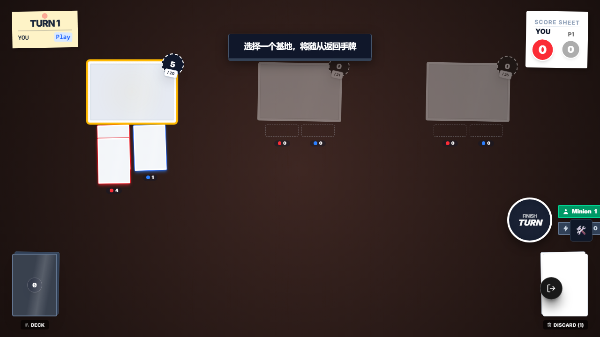
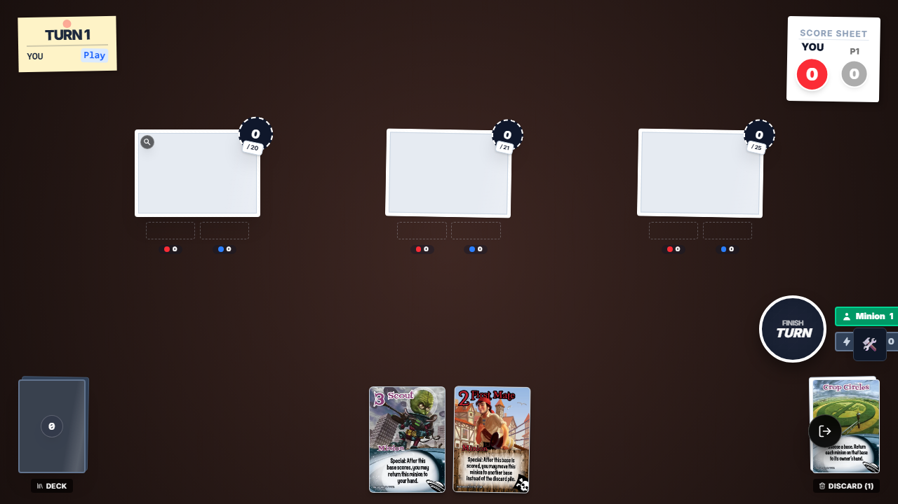
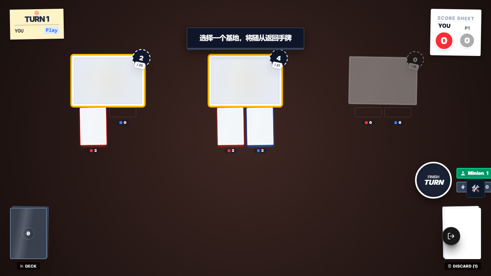
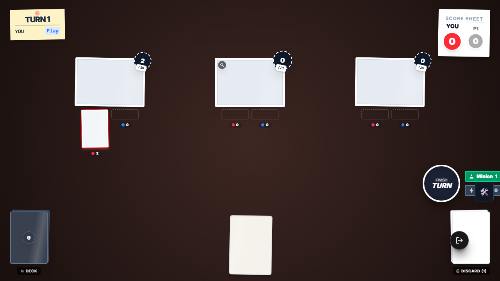

# SmashUp Crop Circles E2E 证据

## 本次目标

将 `e2e/smashup-crop-circles.e2e.ts` 迁移为当前新框架写法，并验证 `alien_crop_circles` 的 3 条真实链路：

1. 选择基地后，返回该基地上的全部随从
2. 只影响被选中的基地，不误伤其他基地
3. 当场上没有任何随从时，不创建交互并给出明确反馈

## 执行命令

- `node .\node_modules\typescript\bin\tsc --noEmit --pretty false`
- `PW_USE_DEV_SERVERS=true npx playwright test e2e/smashup-crop-circles.e2e.ts --reporter=list`

## 关键结论

- `e2e/smashup-crop-circles.e2e.ts` 已使用 `import { test, expect } from './framework'`，并通过 `game.setupScene()` 构造场景。
- `alien_crop_circles` 当前真实语义是单段交互：先选基地，再直接把该基地全部随从返回手牌，不存在第二段连锁选择。
- 这份用例已浏览器实跑通过，结果为 `3 passed`。
- 本轮顺手修了 2 个会影响老 E2E 稳定性的框架问题：
  - `e2e/framework/fixtures.ts` 的 `workerPorts` fixture 首参改为合法解构，避免 Playwright 参数校验直接报错。
  - `e2e/framework/GameTestContext.ts` 的 `game.screenshot()` 现在额外保存一份到稳定的 `e2e/test-results/evidence-screenshots/`，避免截图只落在会被清理的目录里。

## 截图审查

### 1. 无目标时的反馈

审查结论：

- 棋盘上 3 个基地的力量都为 `0`，场上没有任何随从。
- 顶部出现 `No valid targets on the field` 提示，证明不是静默失败。
- 右下角弃牌堆显示 `DISCARD (1)`，与行动牌 `Crop Circles` 已正常结算并进入弃牌堆一致。

### 2. 单基地选择提示

审查结论：

- 顶部 PromptOverlay 明确显示“选择一个基地，将随从返回手牌”。
- 只有左侧基地高亮且其上确实有 2 个随从，其他基地被灰掉，说明交互目标范围正确。
- 这证明 `alien_crop_circles` 触发后创建的是“选基地”交互，而不是直接点随从。

### 3. 单基地结算后的结果

审查结论：

- 左侧基地力量从 `5` 归零，说明该基地上的 2 个随从都被移走。
- 屏幕下方可见两张回到手牌区的卡，分别对应先前在基地上的随从。
- 右下角弃牌堆能看到 `Crop Circles` 卡面，符合“行动牌结算后进入弃牌堆”的预期。

### 4. 多基地可选时的提示

审查结论：

- 左侧和中间两个基地同时高亮，右侧空基地被禁用，说明只有“存在随从的基地”可选。
- 左侧基地力量为 `2`，中间基地力量为 `4`，与场景注入时两边随从数量和力量分布一致。
- 这张图证明多基地场景下，交互选择范围仍然是“基地级别”，没有退化成错误的全场批量结算。

### 5. 多基地场景下只影响选中基地

审查结论：

- 中间基地力量归零，说明被选中的那一侧随从已经全部回手。
- 左侧基地仍保留一个力量 `2` 的随从，证明未被误清空。
- 下方只多出 1 张回手的卡，和“只返回选中基地上的随从”完全一致。

## 最终结果

- `e2e/smashup-crop-circles.e2e.ts`：`3/3` 通过
- 5 张截图已人工审查，并备份到 `evidence/assets/crop-circles-e2e/`
- `alien_crop_circles` 这份老 E2E 已完成重写并具备稳定证据链
