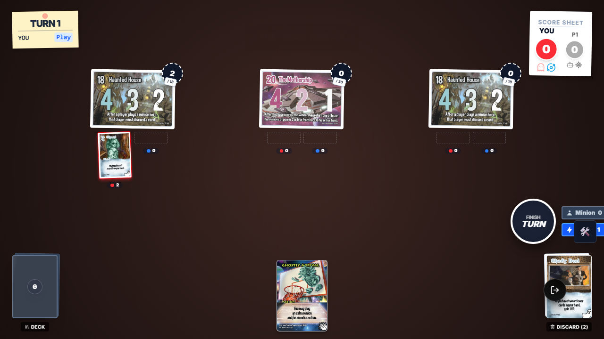
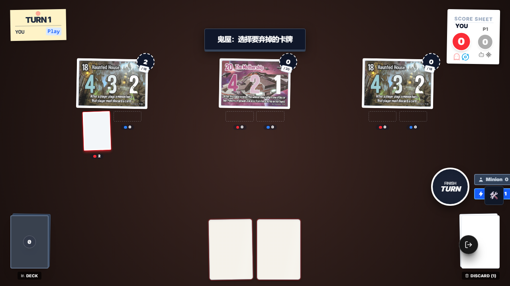
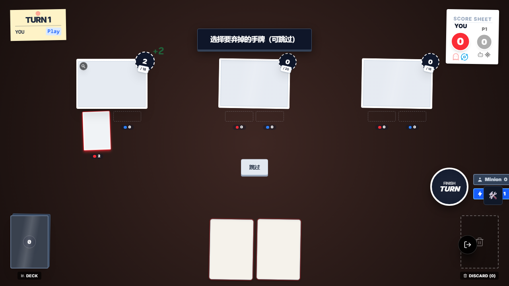
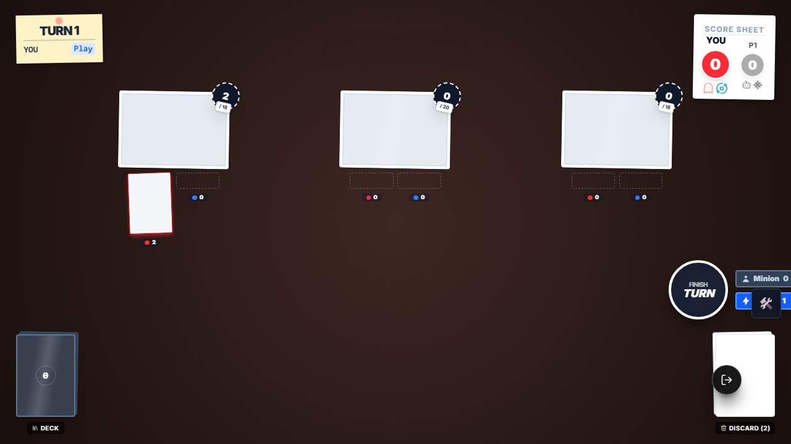
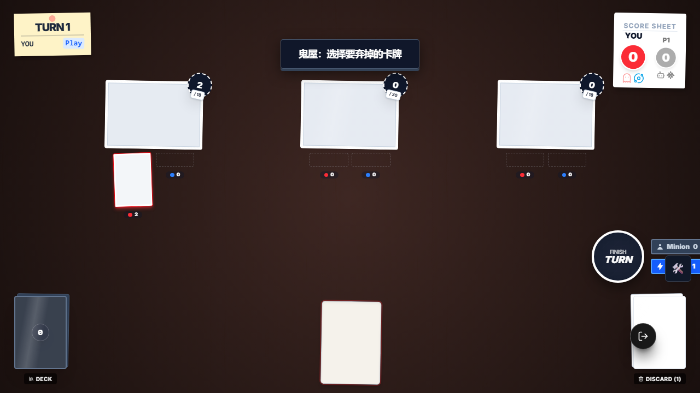

# SmashUp Ghost + Haunted House 链式弃牌 E2E 证据

## 本次目标

将 `e2e/smashup-ghost-haunted-house-discard.e2e.ts` 从错误的旧前提重写为当前规则下真实有效的 E2E，并验证两条链式弃牌路径：

1. `ghost_ghost` 第一段弃牌后，鬼屋第二段只显示最后 1 张最新手牌
2. 当第二段仍需选择时，鬼屋交互只显示最新剩余手牌，不包含已经被第一段弃掉的卡

## 为什么必须重写

- 旧稿的核心前提已经过时：它把“鬼屋”理解成固定的旧基地主动效果，并且混用了已经失效的旧 fixture / 手工 patch 方式。
- 当前代码里真正相关的是 `base_haunted_house_al9000`：
  - 触发时机是 `onMinionPlayed`
  - `ghost_ghost` 也会在 `onPlay` 触发一次弃牌
- 因此现规则下的真实场景是“同一次打出随从后，连续出现两段弃牌链”，这正好对应 stale interaction 的风险点。

## 执行命令

- `node .\node_modules\typescript\bin\tsc --noEmit --pretty false`
- `PW_USE_DEV_SERVERS=true npx playwright test e2e/smashup-ghost-haunted-house-discard.e2e.ts --reporter=list`

## 关键结论

- 该文件已改为 `import { test, expect } from './framework'`，不再依赖旧 fixture。
- 手牌类单选交互在 SmashUp 当前 UI 里是“直接点击手牌卡面”，不是统一的 PromptOverlay 按钮模式。
- 因此这次重写同时确认了：对这类 `targetType: 'hand'` 交互，E2E 应该直接点当前手牌中的 `data-card-uid`。
- 重写后 2 条用例已浏览器实跑通过，并且这份文件已从 `testIgnore` 中移除。

## 截图审查

### 1. 第一段幽灵弃牌提示

审查结论：

- 画面顶部显示“选择要弃掉的手牌（可跳过）”。
- 手牌区正好有两张可弃牌，底部还有 `跳过` 按钮，符合 `ghost_ghost` 的第一段交互语义。
- 这张图证明第一段弃牌交互弹出正常，且玩家手牌只剩 `ghost_seance` 与 `ghost_shady_deal` 两张待选卡。

### 2. 第二段只剩 1 张最新手牌

审查结论：

- 顶部文案已切换为“鬼屋：选择要弃掉的卡牌”。
- 手牌区只剩 1 张卡面可点，没有出现已经在第一段弃掉的那张牌。
- 这张图直接验证了“第二段交互拿到的是最新手牌状态”，不会把第一段已弃牌带回来。

### 3. 第一条链路最终结果

审查结论：

- 左侧鬼屋基地上已经有一张 `Ghost` 随从在场。
- 右下角弃牌堆显示 `Discard (2)`，符合“先弃 `Séance`，再弃 `Shady Deal`”。
- 场上不再有交互层，说明整条两段弃牌链已正常收束。

### 4. 第二条链路的刷新后第二段提示

审查结论：

- 顶部仍是“鬼屋：选择要弃掉的卡牌”。
- 当前手牌区可见两张剩余手牌，数量与断言一致。
- 最重要的是：第一段已弃掉的卡没有重新出现在第二段可选区里，这正是 stale interaction 防御要验证的核心点。

### 5. 第二条链路最终结果

审查结论：

- `Ghostly Arrival` 仍留在手牌区。
- 右下角弃牌堆显示 `Discard (2)`，说明两段弃牌共正确丢了两张。
- 左侧基地上的 `Ghost` 仍在场上，表明“打出随从 + 两段弃牌”整条链已完成且状态一致。

## 根因与修复归纳

### 根因 1：旧测试前提过时

- 旧稿不是单纯“选择器失效”，而是测试场景本身已经不对应当前规则实现。
- 这种情况下继续补旧 helper 只会制造伪回归，最正确方案就是重写。

### 根因 2：手牌交互不是统一的按钮模式

- `ghost_ghost` 和 `base_haunted_house_al9000` 的弃牌交互在当前 UI 中走“手牌直点”模式。
- 旧思路按 PromptOverlay 按钮点击，会把测试写偏。

### 修复

- 这份 E2E 现已完全重写，统一走 `openTestGame + setupScene + sourceId` 的新框架路径。
- 测试交互改为直接点当前手牌卡面，并对 `game.getInteractionOptions()` 做状态校验，确保第二段只看到最新手牌。

## 最终结果

- `e2e/smashup-ghost-haunted-house-discard.e2e.ts`：2/2 通过
- 5 张截图已人工审查并备份到 `evidence/assets/ghost-haunted-house-e2e/`
- 该文件已恢复到 Playwright 正常 discovery 集合
