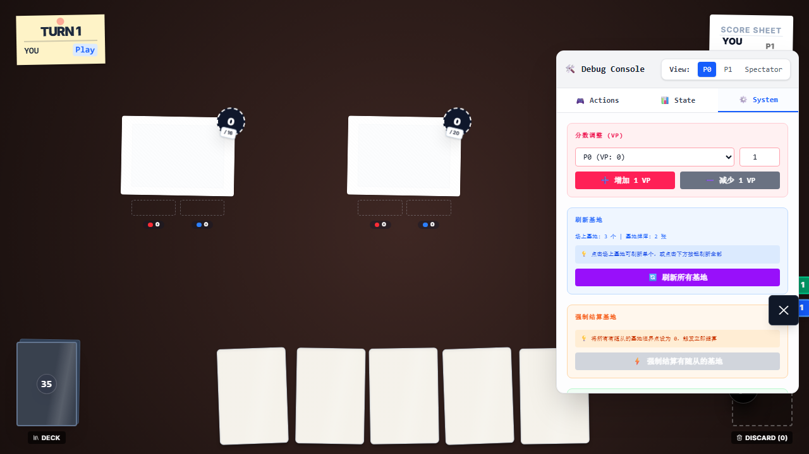
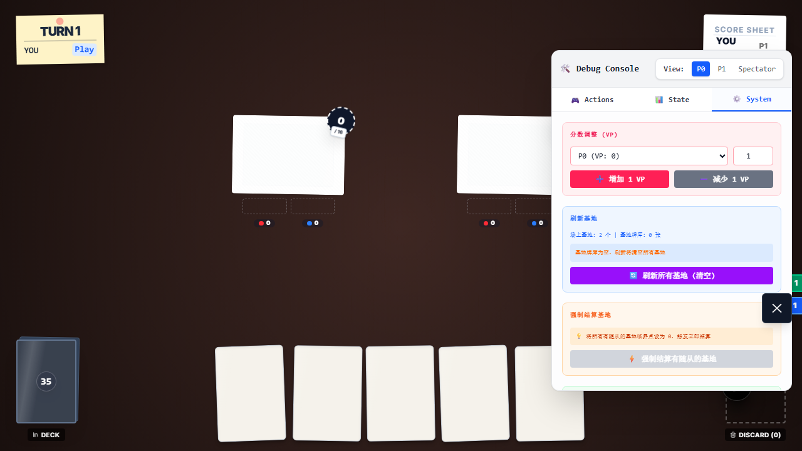

# SmashUp 刷新基地 E2E 证据

## 本次目标

将 `e2e/smashup-refresh-base.e2e.ts` 从旧的 `setupOnlineMatch` 注入模式迁移到当前新框架，并验证两条真实链路：

1. 调试面板可以刷新所有基地
2. 当基地牌堆不足时，会只刷新可用数量的基地

## 执行命令

- `node .\node_modules\typescript\bin\tsc --noEmit --pretty false`
- `npm run test:e2e:ci -- e2e/smashup-refresh-base.e2e.ts`

## 关键结论

- 该文件已迁移为 `import { test, expect } from './framework'`，不再依赖失效的 `./helpers/state-injection`。
- 测试入口已统一使用 `game.openTestGame('smashup', ...)`，符合当前仓库真实可用的 TestHarness 流程。
- 第二条旧断言“基地牌堆不足时按钮应禁用”已经过时；当前实现的真实语义是“按钮仍可点击，但只刷新可用数量的基地”。
- 迁移后 `playwright --list` 仍保持可用，这个文件不再需要待在 `testIgnore` 里。

## 截图审查

### 1. 刷新所有基地后

审查结论：

- 棋盘上只剩 2 个基地，且都为空基地，没有残留随从或 ongoing action。
- 调试面板中“场上基地: 3 个 | 基地牌库: 2 张”与“刷新所有基地”按钮同时可见，说明按钮确实是通过调试面板触发。
- 左下角基地牌堆数量显示为 `35`，与“刷新后基地牌堆减少”这一链路一致。

### 2. 基地牌堆不足时部分刷新后

审查结论：

- 棋盘上变成了 2 个基地，对应测试里人为截断后的 2 张基地牌堆。
- 调试面板显示“场上基地: 2 个 | 基地牌库: 0 张”，并且按钮文案变成“刷新所有基地（清空）”。
- 这证明当前实现不是禁用按钮，而是执行“按可用数量部分刷新”，并在刷新后耗尽基地牌堆。

## 代码层对齐

- `src/games/smashup/debug-config.tsx` 中按钮禁用条件是 `!core?.bases || core.bases.length === 0`，并不关心 `baseDeck.length` 是否小于场上基地数量。
- `src/games/smashup/cheatModifier.ts` 中 `refreshAllBases()` 的行为是：
  - 用 `Math.min(core.bases.length, core.baseDeck.length)` 计算可刷新数量
  - 刷新可用数量的基地
  - 牌堆用完后直接变空
- 因此第二条 E2E 现已改成验证“部分刷新”而不是“按钮禁用”，与当前实现和单测保持一致。

## 最终结果

- `e2e/smashup-refresh-base.e2e.ts`：2/2 通过
- `playwright --list`：通过，且该文件已从 ignore 名单移除
