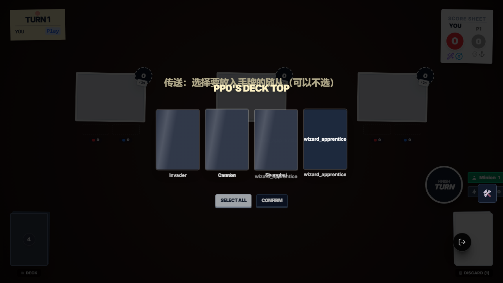
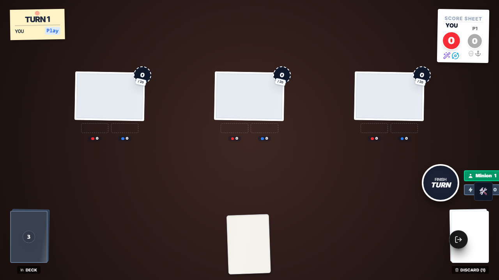
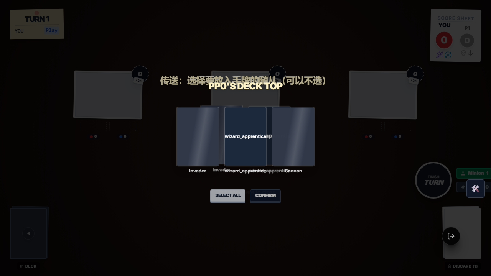
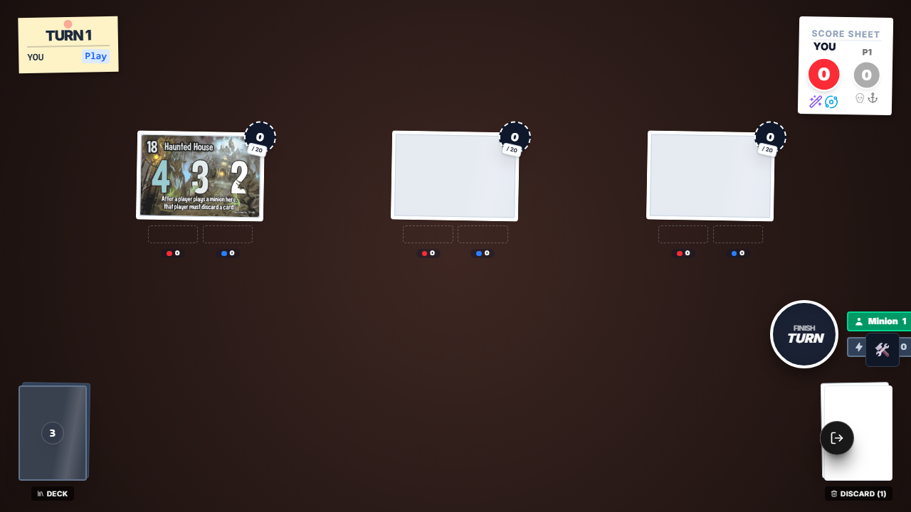
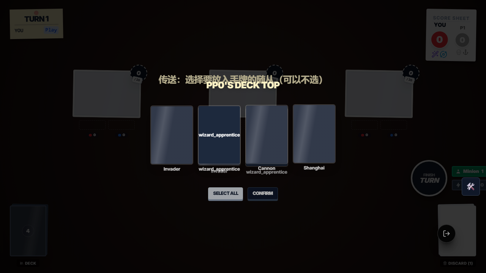
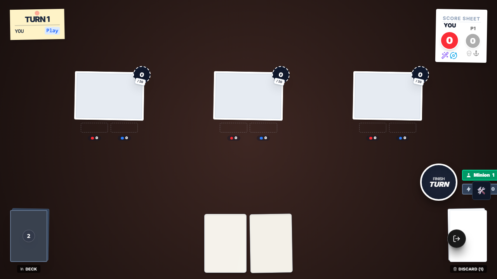

# SmashUp Wizard Portal E2E 证据

## 本次目标

将 `e2e/framework-pilot-wizard-portal.e2e.ts` 收敛为稳定的新框架 E2E，并验证 `wizard_portal` 的 3 条关键链路：

1. 单选 1 张随从加入手牌，并按选择顺序重排剩余牌库顶
2. 0 选随从后，仅重排剩余牌库顶
3. 多选多张随从加入手牌

## 执行命令

- `node .\node_modules\typescript\bin\tsc --noEmit --pretty false`
- `npm run test:e2e:cleanup`
- `npx playwright test e2e/framework-pilot-wizard-portal.e2e.ts --reporter=list`

## 关键结论

- `wizard_portal` 的多选交互 UI 已经不是裸 `Confirm`，而是 `Confirm (1)`、`Confirm (2)` 这种带计数后缀的按钮。
- 之前的失败不是业务逻辑错，而是 `GameTestContext.confirm()` 的按钮匹配过严，只接受精确的 `Confirm` / `确认`。
- 现已放宽为匹配 `Confirm (n)` / `确认 (n)`，同类多选交互也会一起受益。
- 这 3 条 Portal 新框架用例已在浏览器实跑通过。

## 截图审查

### 1. 单选阶段

审查结论：

- 画面中央显示 4 张牌，其中可选随从为 `Invader` 与 `wizard_apprentice`。
- 底部出现 `SELECT ALL` 与 `CONFIRM` 区域，说明当前是多选交互面板，不是旧式单按钮 Prompt。
- 这张图与断言 `multi = { min: 0, max: 2 }` 一致。

### 2. 单选后结果

审查结论：

- 棋盘中央下方能看到 1 张加入手牌的白色牌面，说明单选拿牌成功。
- 左下角牌库数量为 `3`，与“拿走 1 张，剩余 3 张继续排序”一致。
- 右下角弃牌堆显示 `Discard (1)`，说明 `wizard_portal` 自身已进入弃牌堆。

### 3. 0 选阶段

审查结论：

- 画面中央是 `Invader / wizard_apprentice / Cannon` 三张可见牌。
- 底部仍是 `CONFIRM` 按钮，没有单独的 `Skip` 按钮，符合当前实现“空选后确认即跳过”的真实交互语义。
- 这张图直接证明旧测试里寻找 `skip` 选项的思路已经过时。

### 4. 0 选后结果

审查结论：

- 棋盘中央下方没有新增手牌，说明没有任何随从被拿入手牌。
- 左下角牌库数量仍为 `3`，与“只是重排，没有拿牌”一致。
- 右下角弃牌堆仍为 `Discard (1)`，动作卡结算后正确弃置。

### 5. 多选阶段

审查结论：

- 画面中央出现 4 张顶牌，能看到 `Invader`、`wizard_apprentice`、`Cannon`、`Shanghai`。
- 当前 UI 仍是多选样式，底部确认按钮为计数型确认按钮。
- 这张图证明 Portal 在多选场景下与单选场景共用同一交互组件，只是已选数不同。

### 6. 多选后结果

审查结论：

- 棋盘中央下方出现 2 张加入手牌的白色牌面，符合“同时拿两张随从”的预期。
- 左下角牌库数量降为 `2`，与“顶牌 4 张中拿走 2 张，其余 2 张按顺序回顶”一致。
- 这张图和断言 `deck.slice(0, 2) === ['pirate_shanghai', 'pirate_cannon']` 的结果相匹配。

## 根因与修复归纳

### 根因

- `GameTestContext.confirm()` 使用了过严的按钮正则，只匹配精确 `Confirm` / `确认`。
- Portal 多选交互改版后，按钮文案变为 `Confirm (n)`，导致测试框架找不到按钮并超时。

### 修复

- 将 `e2e/framework/GameTestContext.ts` 中 `confirm()` / `skip()` 的按钮匹配放宽为支持计数后缀。
- Portal 文件继续保留新框架写法，不再回退到旧 helper 或旧 fixture。

## 最终结果

- `e2e/framework-pilot-wizard-portal.e2e.ts`：3/3 通过
- `wizard_portal` 单选 / 空选 / 多选链路：浏览器实跑通过
- 6 张截图已人工审查并备份到 `evidence/assets/wizard-portal-e2e/`
